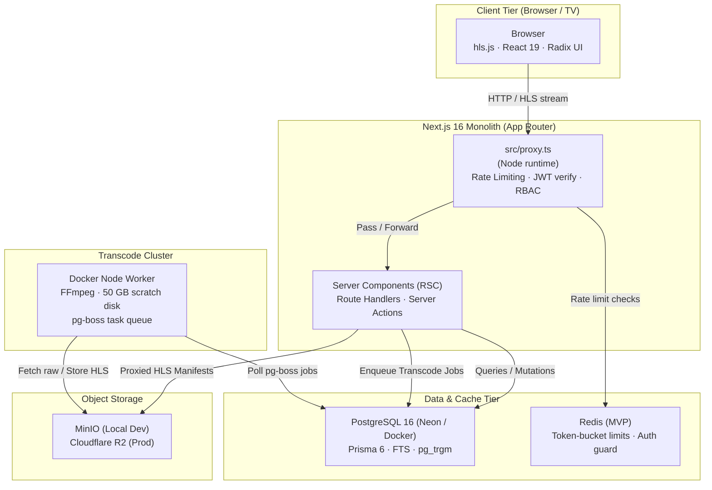

# StreamForge

> **High-Performance, Accessible, Dark-First OTT Streaming Platform**  
> Built as a production-grade monolith using **Next.js 16 (App Router)**, **React 19**, **Tailwind CSS v4**, **PostgreSQL 16 (Prisma 6)**, **Redis**, and a dedicated **Docker FFmpeg Transcode Worker**.

---

## Overview

StreamForge is an architectural implementation of a modern, multi-profile video streaming platform delivering:

- **Instant Video Streaming:** Multi-bitrate HLS streaming (`360p` to `1080p`) with bespoke React player chrome over `hls.js`, supporting keyframe-aligned ABR, dynamic audio/subtitle tracks, and HMAC-signed URLs.
- **Dark-First Cinematic Experience:** OKLCH design tokens using Tailwind CSS v4 `@theme static`, native CSS scroll-driven animations, Ken Burns billboard hero trailer lifecycle, and ambient artwork dominant-color theming.
- **Multi-Profile & Parental Controls:** Independent watchlist, continue-watching, and history per profile; 4-digit PIN verification modal with lockout timer when switching from Kids to Adult profiles.
- **Freemium & Anonymous Streaming:** Free content streams anonymously without login; gated Standard/Premium titles display plan padlock badges and trigger comparison upgrade modals.
- **Architectural Defense-in-Depth:** Node.js proxy middleware with Redis token-bucket rate limiting, family-based refresh token rotation (`Path=/api/auth`), Argon2id password hashing with dummy-hash timing attack prevention, and strict ESLint module boundary enforcement.

---

## High-Level Architecture



---

## Tech Stack

| Layer             | Technology                                    | Key Constraint                                                                                          |
| ----------------- | --------------------------------------------- | ------------------------------------------------------------------------------------------------------- |
| **Framework**     | Next.js 16 (App Router), React 19, TypeScript | Server Components by default; `src/` layout ([ADR-0010](./docs/adr/0010-repo-layout-src-directory.md)). |
| **Styling**       | Tailwind CSS v4 (`@tailwindcss/postcss`)      | Top-level `@theme static` tokens; no raw values in `.tsx`.                                              |
| **Database**      | PostgreSQL 16 + Prisma 6                      | `directUrl` for migrations; partial unique indexes for `watch_progress`.                                |
| **Auth**          | Custom JWT + Argon2id                         | `httpOnly` cookies; refresh cookie scoped to `Path=/api/auth` with family rotation.                     |
| **Storage**       | MinIO (local dev) / Cloudflare R2 (prod)      | Buckets NOT publicly accessible; all HLS served via manifest proxy route handler.                       |
| **Transcoding**   | Docker Node worker + FFmpeg                   | Bounded 50 GB host scratch disk (`worker-scratch`); allowlisted egress; magic-byte check.               |
| **Job Queue**     | pg-boss (Postgres-backed)                     | Worker uses `DATABASE_DIRECT_URL`; 2h timeout; heartbeat monitoring.                                    |
| **Rate Limiting** | Redis token bucket in `src/proxy.ts`          | 100/min general; 10/15m IP + 5/15m account on auth; fail-closed for auth endpoints.                     |
| **Video Engine**  | `hls.js` + bespoke React controls             | Custom player chrome; quality picker with locked plan tiers; dynamically imported.                      |

---

## Repository Structure (`src/` Layout)

StreamForge strictly enforces modular monolith boundaries per [ADR-0010](./docs/adr/0010-repo-layout-src-directory.md):

```
.
├── src/
│   ├── app/                          # Next.js App Router (pages, layouts, route handlers)
│   │   ├── (app)/                    # Browse shell, home, watch, title detail modal
│   │   ├── (auth)/                   # Login, signup, onboarding
│   │   ├── (admin)/                  # Catalog management, video uploads, transcode status
│   │   ├── api/                      # REST endpoints (auth, hls proxy, player beacon, upload)
│   │   ├── layout.tsx                # Root layout (Outfit & Inter fonts, theme setup)
│   │   └── globals.css               # Global styles & Tailwind v4 @theme static block
│   ├── modules/                      # Domain business modules (Strict boundary enforcement)
│   │   ├── auth/                     # JWT tokens, refresh family, Argon2id, parental PIN
│   │   ├── content/                  # Titles, series, seasons, episodes, rails, visibility
│   │   ├── video/                    # Transcode jobs, HMAC signing, manifest rewriting
│   │   ├── player/                   # QoS telemetry, watch progress, resume state
│   │   ├── billing/                  # Plans, subscription lifecycle, entitlements
│   │   └── admin/                    # Audit logs, job retries, CMS mutations
│   ├── components/                   # Shared UI primitives (Radix, Sonner, Vaul, Embla)
│   ├── lib/                          # Infrastructure clients (db, storage, redis, logger)
│   └── proxy.ts                      # Node.js middleware for rate limiting and RBAC
├── workers/                          # Standalone Docker transcode worker (Node + FFmpeg)
├── prisma/                           # Database schema and raw SQL migrations
├── docs/                             # Comprehensive specifications and ADRs
├── AGENTS.md                         # Contributor contract & agent non-negotiables
├── GEMINI.md                         # Gemini Assistant developer rules
└── CLAUDE.md                         # Claude Code developer rules
```

### Module Boundary Rules (ESLint Enforced)

Each domain module inside `src/modules/<name>/` exposes a strict internal layout:

```
src/modules/<name>/index.ts    ← Public API for the module (only allowed export)
src/modules/<name>/dal.ts      ← Data-Access Layer (ONLY file that may import Prisma/db)
src/modules/<name>/service.ts  ← Business logic and validation
src/modules/<name>/actions.ts  ← Server Actions (thin wrappers calling services)
```

- Only `*.dal.ts` may import `@prisma/client` or `@/lib/db`.
- No module may import another module's internal files — import only from `src/modules/<name>/index.ts`.
- Client components (`'use client'`) must never import from `src/modules/*/` directly.

---

## Quick Start & Essential Commands

### Prerequisites

- Node.js 20+ (LTS)
- Docker & Docker Compose
- npm 10+

### Local Setup

```bash
# 1. Install dependencies
npm install

# 2. Boot local infrastructure (Postgres, MinIO, Redis, Transcode Worker)
docker compose up -d

# 3. Apply database migrations & seed initial catalog
npm run db:migrate:dev
npm run db:seed

# 4. Download and seed sample open-licensed HLS assets (Big Buck Bunny)
npm run seed:media

# 5. Start the Next.js development server
npm run dev

# 6. Start the background video transcode worker (in a separate terminal)
npm run worker
```

Open [http://localhost:3000](http://localhost:3000) to view the application.

---

## Quality Gates & Verification

Every pull request must pass the automated CI verification gates:

```bash
# Linting & module boundary enforcement
npm run lint

# TypeScript compilation check
npm run type-check

# Vitest unit test suite (entitlements, HMAC, visibility)
npm test

# Playwright end-to-end matrix tests
npm run test:e2e

# Automated WCAG 2.2 AA accessibility audit
npm run test:a11y

# Traceability matrix consistency check
npm run db:orphan-check
```

---

## Documentation Map

| Document                                                               | Purpose                                                                 |
| ---------------------------------------------------------------------- | ----------------------------------------------------------------------- |
| [**docs/00-README.md**](./docs/00-README.md)                           | Complete Documentation Index & Reading Order                            |
| [**docs/implementation-tracker.md**](./docs/implementation-tracker.md) | **Live Implementation Tracker** (Done, In-Progress & Pending Pipelines) |
| [**docs/traceability.md**](./docs/traceability.md)                     | User Story $\to$ Endpoint $\to$ DB $\to$ UI Traceability Matrix         |
| [**docs/decision-register.md**](./docs/decision-register.md)           | Consolidated Decision Register & Conflict Log (CF-01 to CF-25)          |
| [**docs/design/design-tokens.md**](./docs/design/design-tokens.md)     | Design Tokens & Tailwind CSS v4 `@theme static`                         |
| [**docs/07-video-pipeline.md**](./docs/07-video-pipeline.md)           | Video Pipeline, Transcoding Engine & Player Spec                        |
| [**AGENTS.md**](./AGENTS.md)                                           | Contributor Contract, Stack Rules & Non-Negotiables                     |

---

## License

StreamForge is open-source software licensed under the [MIT License](./LICENSE). Sample media assets are credited under Creative Commons licenses in [`docs/16-legal-and-trust.md`](./docs/16-legal-and-trust.md).
