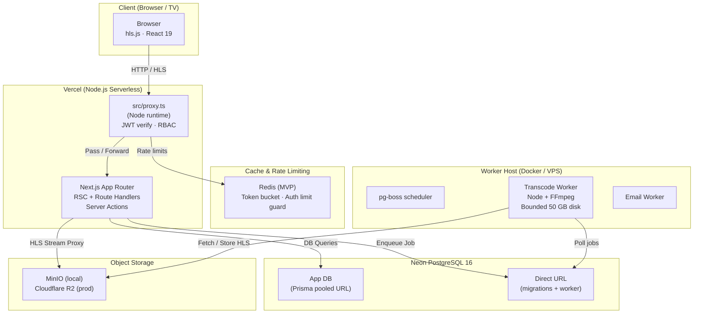
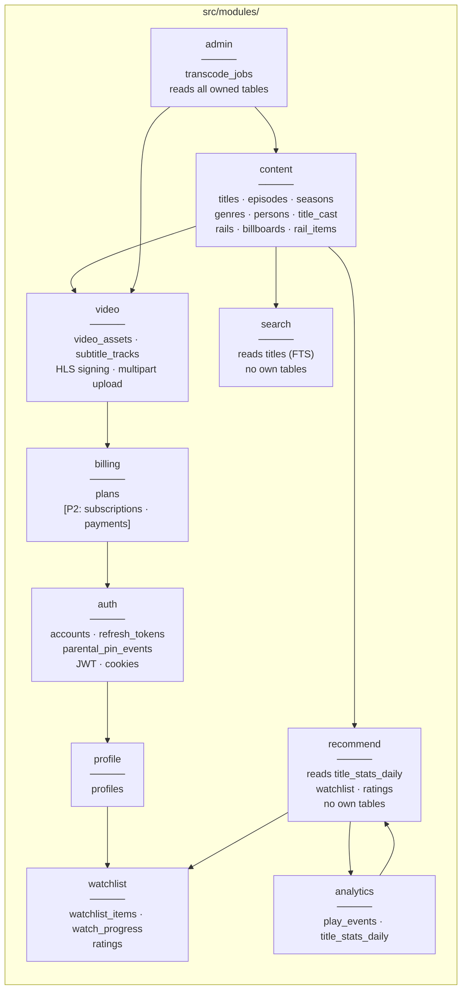
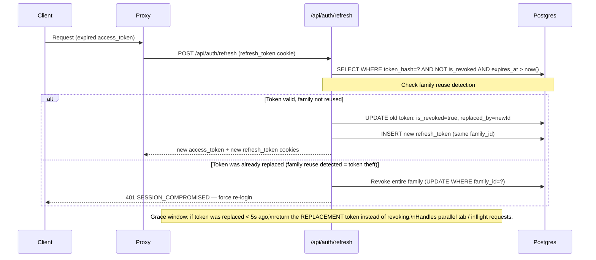
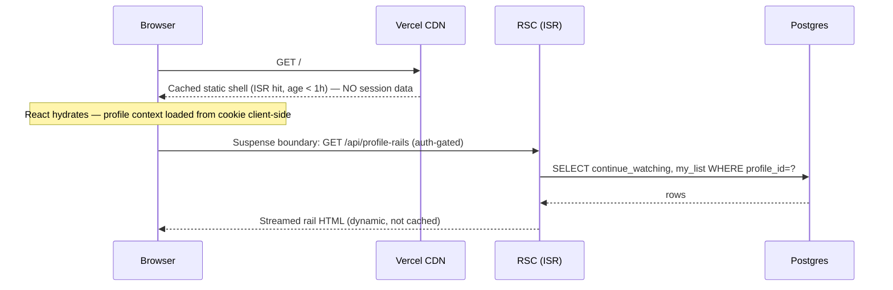
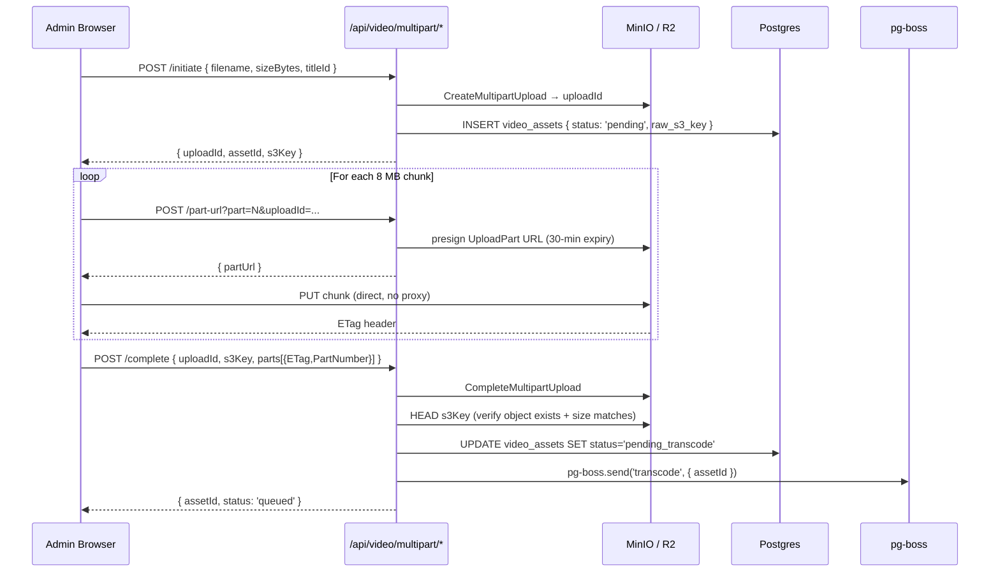

# 04 – Architecture

> **Pattern:** Next.js 16 App Router monolith with clear module boundaries and defence-in-depth.  
> **Decisions resolved:** `src/proxy.ts` (Node runtime), Redis token-bucket rate limiting (fail-closed for auth), client-driven refresh (`Path=/api/auth`), static-shell + streamed per-profile home page, anonymous free-tier playback, S3 multipart upload via Uppy, FFmpeg in Docker with bounded 50 GB scratch disk, direct-insert analytics.

---

## Guiding Principles

1. **Monolith first** — one repo, one deploy, one `docker compose up`
2. **Module boundaries are strict** — `src/modules/X` only crosses via its `index.ts` public interface; enforced by ESLint
3. **Defence in depth** — proxy checks JWT shape; data-access layer (DAL) re-checks session + role; no route trusts only the proxy
4. **Server Components by default** — Client Components only when interactivity is required
5. **Async jobs stay out of the request path** — transcoding and email via pg-boss; analytics are direct-batch inserts, not queued
6. **Cache public, stream private** — ISR for anonymous content; Suspense for per-profile rails
7. **Anonymous playback of free content** — `/watch/[id]` is publicly routable; entitlement gating is inside the Route Handler

---

## High-Level Architecture


        StatsJob["Stats Aggregator\n(title_stats_daily)"]
    end

    subgraph Redis["Redis (local + prod)"]
        RateStore["Rate-limit buckets\ntoken bucket state"]
    end

    Browser -->|"HTTPS"| Proxy
    Proxy --> AppRouter
    AppRouter --> DB
    AppRouter --> MinIO
    AppRouter -->|"batch INSERT"| DB
    WorkerHost --> DBDirect
    WorkerHost --> MinIO
    Browser -->|"S3 multipart PUT\n(presigned)"| MinIO
    Proxy -->|"INCR / check"| RateStore
```

---

## Module Boundaries & Table Ownership



### Module public interface rule

Each module exposes **only** through:
- `src/modules/[name]/index.ts` — types and read-only query helpers other modules may call
- `src/modules/[name]/actions.ts` — Server Actions (callable from RSC)
- `src/modules/[name]/api/` — Route Handlers for REST clients

**Boundary enforcement tooling (CI Gate):**
Enforced automatically via ESLint 9+ flat config in `eslint.config.mjs` and verified on every PR via `npm run lint`:

```javascript
// eslint.config.mjs (CI Gate)
export default defineConfig([
  {
    rules: {
      "no-restricted-imports": [
        "error",
        {
          patterns: [
            {
              group: ["@/modules/*/*", "!@/modules/*/index", "!@/modules/*/actions"],
              message: "Deep imports into module internals are forbidden. Import from public index.ts or actions.ts only."
            },
            {
              group: ["@prisma/client", "@/lib/db"],
              message: "Direct database access is restricted to DAL files (*.dal.ts)."
            }
          ]
        }
      ]
    }
  },
  {
    files: ["src/modules/**/*.dal.ts", "src/lib/db.ts", "prisma/**"],
    rules: {
      "no-restricted-imports": [
        "error",
        {
          patterns: [
            {
              group: ["@/modules/*/*", "!@/modules/*/index", "!@/modules/*/actions"],
              message: "Deep imports into module internals are forbidden."
            }
          ]
        }
      ]
    }
  }
])
```
Violations immediately fail the `npm run lint` step in GitHub Actions. Deep imports (e.g. `@/modules/billing/queries`) or direct Prisma calls outside `*.dal.ts` break the build.

### Microservices extraction note

Extracting a module to a microservice requires:
1. Replacing `index.ts` imports with an HTTP/gRPC client
2. Moving the worker to a separate Docker image
3. Updating the DAL callers to handle network errors

It is **not** zero code changes — the extraction is straightforward but deliberate. The boundary discipline makes it tractable, not automatic.

---

## Folder Structure

```
ott-monolith/
├── src/
│   ├── app/                          # Next.js App Router (lives inside src/)
│   │   ├── (public)/                 # No-auth segment — ISR-cacheable
│   │   │   ├── page.tsx              # Home /  (static shell + Suspense per-profile)
│   │   │   ├── browse/[genre]/
│   │   │   ├── title/[slug]/
│   │   │   ├── search/
│   │   │   └── watch/[id]/           # Free-tier accessible; entitlement in handler
│   │   ├── (auth)/                   # Auth-required segment (proxy guards)
│   │   │   ├── profiles/             # Profile picker
│   │   │   ├── my-list/
│   │   │   ├── history/
│   │   │   ├── account/
│   │   │   └── checkout/[planId]/
│   │   ├── (admin)/                  # Admin-only segment (proxy + DAL guard)
│   │   │   └── admin/
│   │   │       ├── content/
│   │   │       ├── rails/
│   │   │       ├── analytics/
│   │   │       └── jobs/
│   │   ├── api/
│   │   │   ├── auth/
│   │   │   │   ├── login/route.ts
│   │   │   │   ├── signup/route.ts
│   │   │   │   ├── refresh/route.ts
│   │   │   │   └── logout/route.ts
│   │   │   ├── content/[slug]/route.ts
│   │   │   ├── video/
│   │   │   │   ├── multipart/
│   │   │   │   │   ├── initiate/route.ts
│   │   │   │   │   ├── part-url/route.ts
│   │   │   │   │   └── complete/route.ts
│   │   │   │   └── playback/[assetId]/route.ts
│   │   │   ├── watchlist/route.ts
│   │   │   ├── progress/route.ts
│   │   │   ├── search/route.ts
│   │   │   └── analytics/events/route.ts   # batch INSERT (no pg-boss)
│   │   ├── layout.tsx
│   │   └── globals.css
│   │
│   ├── modules/
│   │   ├── auth/
│   │   │   ├── index.ts              # getSession(), requireSession(), requireAdmin()
│   │   │   ├── actions.ts
│   │   │   ├── jwt.ts
│   │   │   ├── dal.ts                # DB queries owned by auth
│   │   │   └── types.ts
│   │   ├── content/
│   │   ├── video/
│   │   ├── profile/
│   │   ├── watchlist/
│   │   ├── search/
│   │   ├── billing/
│   │   ├── admin/
│   │   ├── analytics/
│   │   └── recommend/
│   │
│   ├── lib/
│   │   ├── db.ts                     # Prisma client singleton (pooled URL)
│   │   ├── storage.ts                # S3-compatible client (MinIO / R2)
│   │   ├── queue.ts                  # pg-boss client (direct URL)
│   │   ├── rate-limit.ts             # Redis token-bucket helper
│   │   ├── logger.ts                 # Pino
│   │   ├── errors.ts                 # AppError + HTTP factories
│   │   └── env.ts                    # Zod-validated env
│   │
│   ├── components/
│   │   ├── ui/
│   │   ├── player/
│   │   │   ├── VideoPlayer.tsx       # 'use client' — hls.js wrapper
│   │   │   └── PlayerControls.tsx
│   │   ├── content/
│   │   │   ├── ContentCard.tsx
│   │   │   ├── ContentRail.tsx       # RSC — receives pre-fetched data
│   │   │   ├── ProfileRails.tsx      # 'use client' — streamed per-profile
│   │   │   └── Billboard.tsx
│   │   └── layout/
│   │
│   ├── proxy.ts                      # Next.js middleware (Node runtime, not Edge)
│   └── types/
│
├── prisma/
│   ├── schema.prisma
│   ├── migrations/                   # Applied by CI, not Vercel build
│   └── seed.ts
│
├── workers/                          # Standalone Docker container
│   ├── index.ts
│   ├── transcode.worker.ts           # FFmpeg HLS transcoding
│   ├── email.worker.ts
│   └── stats.worker.ts               # Aggregate title_stats_daily
│
├── docker-compose.yml                # postgres · minio · redis · worker
├── Dockerfile.worker                 # Node + FFmpeg image for worker
├── .env.example
└── package.json
```

---

## Proxy (src/proxy.ts) — Node Runtime

```typescript
// src/proxy.ts   ← Next.js config points here via `experimental.serverMiddlewarePath` 
// NOT Edge runtime — runs on Node so it can hit Redis synchronously

export const config = {
  matcher: [
    '/admin/:path*',
    '/my-list/:path*',
    '/history/:path*',
    '/account/:path*',
    '/checkout/:path*',
    '/profiles/:path*',
    '/api/watchlist/:path*',
    '/api/progress/:path*',
    '/api/admin/:path*',
    '/api/auth/logout',
  ]
}

// Responsibilities (in order):
// 1. IP and account rate limiting via Redis token bucket (100 req/min general; 10/15min IP + 5/15min account on auth endpoints). Auth rate limits fail-closed if Redis is down.
// 2. Verify access_token cookie JWT shape (no DB hit)
// 3. If JWT expired: downstream client triggers client-driven refresh via POST /api/auth/refresh (refresh cookie has Path=/api/auth)
// 4. RBAC: /admin/** and /api/admin/** require role === 'admin'
// 5. Inject x-account-id, x-profile-id, x-role, x-is-kids headers for downstream RSC/handlers
//
// NOTE: Proxy checks are necessary-but-not-sufficient.
// Every Server Action and Route Handler MUST call requireSession() / requireAdmin()
// from src/modules/auth/index.ts (the DAL check) before touching any data.
```

### Profile Switching & Session Claims in JWT
- Active profile state is stored directly in the `access_token` JWT payload:
  ```typescript
  interface SessionJwtPayload {
    accountId: string
    profileId: string
    role: 'user' | 'admin'
    isKids: boolean
    maxMaturity: string
    exp: number
  }
  ```
- **Profile Switching (`selectProfile`):**
  - Switching to a kids profile is unconstrained.
  - Switching **from** a kids profile to a non-kids profile requires parental PIN verification (either passed into `selectProfile(profileId, pin)` or validated by a short-lived PIN clearance cookie from `POST /api/auth/pin/verify`).
  - Upon successful profile switch, the access token JWT is re-issued with the target profile claims, and `refresh_tokens.active_profile_id` is updated in Postgres so subsequent silent refreshes maintain the selected profile.

### Defence-in-depth layers

| Layer | What it checks | How |
|-------|---------------|-----|
| Proxy (`proxy.ts`) | JWT shape, expiry, RBAC role, profile headers | `jose` verify, no DB |
| Route Handler / Server Action | Session exists + profile belongs to account + plan entitlement + PIN clearance if leaving kids | `requireSession()` → DB read |
| Prisma DAL | Row-level scoping (always filter by `profileId` / `accountId`) | Query includes |
| DB | CHECK constraints, NOT NULL, FK cascades | Postgres |

---

## Rate Limiting (Redis token bucket)

```typescript
// src/lib/rate-limit.ts
import { Redis } from 'ioredis'

export async function checkRateLimit(
  key: string,            // e.g. "rl:ip:1.2.3.4" or "rl:auth:1.2.3.4"
  limit: number,          // max requests
  windowSec: number       // window in seconds
): Promise<{ allowed: boolean; remaining: number; resetAt: number }> {
  // Lua script — atomic token bucket in Redis
  // Uses INCR + EXPIRE pattern (sliding counter)
}
```

| Route group | Key pattern | Limit | Window |
|-------------|-------------|-------|--------|
| `POST /api/auth/*` | `rl:auth:{ip}` | 10 | 60 s |
| `POST /api/auth/signup` | `rl:signup:{ip}` | 5 | 3600 s |
| `POST /api/video/multipart/*` | `rl:upload:{accountId}` | 5 | 3600 s |
| `POST /api/analytics/events` | `rl:analytics:{profileId}` | 60 | 60 s |
| All others | `rl:general:{ip}` | 100 | 60 s |

Rate-limit state is in Redis. In local dev, Redis runs in docker compose. In production, Redis on the same worker VPS (or Upstash Redis for Vercel serverless).

---

## Refresh Token Rotation with Grace Window



**Grace window implementation:**
```typescript
// Within /api/auth/refresh handler:
const token = await db.refreshToken.findUnique({ where: { tokenHash } })

if (token.isRevoked) {
  const replacedRecently = token.replacedAt && 
    Date.now() - token.replacedAt.getTime() < 5_000  // 5-second grace

  if (replacedRecently && token.replacedBy) {
    // Return the already-issued replacement (idempotent for parallel tabs)
    const replacement = await db.refreshToken.findUnique({ where: { id: token.replacedBy } })
    return issueNewAccessToken(replacement)
  }
  // Reuse detected beyond grace window → revoke family
  await db.refreshToken.updateMany({ 
    where: { familyId: token.familyId }, 
    data: { isRevoked: true } 
  })
  throw new AppError(401, 'SESSION_COMPROMISED')
}
```

---

## Home Page Caching Strategy



**Implementation approach:** Route Segment Config (not Cache Components — Cache Components are an experimental opt-in):

```typescript
// src/app/(public)/page.tsx
export const revalidate = 3600  // ISR: 1 hour for static shell

// The page renders:
// 1. <Billboard /> — static, in ISR cache
// 2. <ContentRail /> × N — static genre rails, in ISR cache  
// 3. <Suspense fallback={<RailSkeleton />}>
//      <ProfileRails />   ← 'use client', fetches /api/profile-rails after hydration
//    </Suspense>
//
// IMPORTANT: No session/geo reads happen in the ISR render path.
// x-account-id and x-profile-id headers are NOT read in the static shell.
```

### Public Shell Cache Variants & Audience Scopes

1. **Two Static Cache Variants:**
   - **General Shell (`tag: rails-general`, ISR 1h):** Served to anonymous visitors and adult profiles. Displays full catalog of published titles across all maturity ratings.
   - **Kids Shell (`tag: rails-kids`, ISR 1h):** Served when browsing in kids mode (`/kids` route segment or `x-profile-mode=kids` cookie). Contains only age-appropriate titles (`min_age <= 7` or ratings `U`, `U/A 7+`).
2. **Anonymous Audience Scope:**
   - Anonymous visitors receive the **General Shell**.
   - Can browse all catalog titles and genre pages freely.
   - Paid titles display lock badges with plan requirement CTAs.
   - Free titles (`tier_rank = 0`) can be played immediately without login or card details.
   - Personalised rails (`Continue Watching`, `My List`) are omitted; client placeholder prompts sign-in.
3. **Lock Badge Resolution (No Leaks, No Flash):**
   - **Safe-by-default server render:** The static HTML renders all titles with `min_tier_rank > 0` with a locked badge indicator and tier pill.
   - **Client hydration:** Client reads user session (`user.tier_rank`). If `user.tier_rank >= title.min_tier_rank`, the lock badge smoothly unlocks without causing layout shift (matching container dimensions).
   - **No Flashing:** Unentitled or anonymous viewers never see an unlocked state flash because the baseline HTML is locked by default.

### Cache Invalidation Table

| Event / Mutation | Affected Tags & Paths | Invalidation Method | Fallback TTL |
|------------------|-----------------------|---------------------|--------------|
| **Title Published / Scheduled Live** | `tag: title-{id}`, `tag: rails-general`, `tag: rails-kids`, `tag: genres` | `revalidateTag()`, `revalidatePath('/title/[slug]')` | 1 hour |
| **Title Metadata / Poster Updated** | `tag: title-{id}` | `revalidateTag('title-' + id)`, `revalidatePath('/title/[slug]')` | 6 hours |
| **Rail Reordered / Curation Change** | `tag: rails-general`, `tag: rails-kids` | `revalidateTag('rails-general')`, `revalidateTag('rails-kids')` | 1 hour |
| **Hero Billboard Updated** | `tag: billboard` | `revalidateTag('billboard')` | 1 hour |
| **Top-10 Daily Recalculation** | `tag: rails-top10` | Daily worker calls `revalidateTag('rails-top10')` | 6 hours |
| **Title Soft-Deleted / Archived** | `tag: title-{id}`, `tag: rails-general`, `tag: rails-kids` | `revalidateTag()` on all associated content tags | Immediate |

### Scheduled-Publish Mechanism
Titles can be scheduled for future release (`status = 'scheduled'`, `publish_at = future_timestamp`):
1. **Query-level enforcement:** All catalog queries strictly enforce `status = 'published' AND publish_at <= NOW()`. Even if cached, an unpublished title is never returned by the DAL.
2. **pg-boss Background Cron (`publish-scheduler`):**
   - Runs every 60 seconds on the worker VPS:
     ```sql
     UPDATE titles 
     SET status = 'published' 
     WHERE status = 'scheduled' AND publish_at <= NOW()
     RETURNING id, is_kids;
     ```
   - When one or more titles transition to `published`, the worker triggers cache invalidation via internal webhook to Next.js (`POST /api/internal/revalidate` with shared secret), calling `revalidateTag('rails-general')` and `revalidateTag('rails-kids')`.

### Caching Table

| Data | Strategy | TTL | Session in render? |
|------|----------|-----|--------------------|
| Home page static shell (General) | ISR (`tag: rails-general`, `revalidate: 3600`) | 1 hour | ❌ No |
| Home page static shell (Kids) | ISR (`tag: rails-kids`, `revalidate: 3600`) | 1 hour | ❌ No |
| Title detail page | ISR (`tag: title-{id}`, `revalidate: 21600`) | 6 hours | ❌ No |
| Top-10 / trending rail | ISR (`tag: rails-top10`, `revalidate: 21600`) | 6 hours | ❌ No |
| New releases rail | ISR (`revalidate: 3600`) | 1 hour | ❌ No |
| Per-profile rails (continue watching, My List) | Dynamic (client fetch after hydration) | No cache | ✅ Yes |
| Search results | Dynamic (no cache) | — | Optional |
| Thumbnail / poster images | CDN (immutable) | 1 year | ❌ No |
| HLS `.ts` segments | CDN / MinIO | Immutable | ❌ No (token in URL) |
| API `/api/content` list | `Cache-Control: s-maxage=300` | 5 min | ❌ No |

---

## Request Flows

### S3 Multipart Upload (Video)



### Auth: Refresh Token Sequence (simplified)
Already shown above in the grace window section.

### Analytics: Batch Insert (no pg-boss)

```typescript
// src/app/api/analytics/events/route.ts
// pg-boss is NOT used here — analytics events are low-risk, high-volume,
// best handled as a direct batched INSERT.

export async function POST(req: Request) {
  const { events } = await req.json()  // up to 50 events per call
  
  // Fire-and-forget: don't await, don't fail the response on DB error
  db.$executeRaw`
    INSERT INTO play_events (profile_id, anonymous_id, title_id, episode_id, 
      video_asset_id, event_type, position_seconds, quality, device_type, occurred_at)
    SELECT * FROM jsonb_to_recordset(${JSON.stringify(events)}::jsonb) AS ...
  `.catch(logger.error)  // log but don't surface to client
  
  return Response.json({ accepted: events.length }, { status: 202 })
}
```

pg-boss is reserved for: transcode jobs, email sends, `title_stats_daily` aggregation (runs nightly).

---

## Worker Host: Docker Compose (Local) / VPS (Production)

**Answers OQ1 from previous version:** The transcode worker is an **always-on Docker service**, not a Vercel Cron Job. Vercel has a 60s max duration — useless for a 10-minute transcode. Production: run the Docker image on a small VPS (e.g., DigitalOcean $12/mo Droplet).

```yaml
# docker-compose.yml (excerpt)
services:
  worker:
    build:
      context: .
      dockerfile: Dockerfile.worker     # Node 20 + ffmpeg
    environment:
      DATABASE_URL: ${DATABASE_DIRECT_URL}   # ← direct (non-pooled) Neon URL
      REDIS_URL: ${REDIS_URL}
      MINIO_ENDPOINT: ${MINIO_ENDPOINT}
    depends_on:
      - postgres
      - redis
      - minio
    restart: unless-stopped

  postgres:
    image: postgres:16-alpine
    ...
  redis:
    image: redis:7-alpine
    ...
  minio:
    image: minio/minio
    ...
```

**Neon connection note:** The worker uses `DATABASE_DIRECT_URL` (non-pooled Neon connection) because:
1. pg-boss requires advisory locks and `LISTEN/NOTIFY` — not supported through PgBouncer/pooled connections
2. FFmpeg jobs are long-lived; pooled connections are recycled aggressively
3. Prisma migrations also require `directUrl` in `schema.prisma`

```prisma
datasource db {
  provider  = "postgresql"
  url       = env("DATABASE_URL")         // pooled — used by the Next.js app
  directUrl = env("DATABASE_DIRECT_URL")  // direct — used by prisma migrate + worker
}
```

---

## Environment Matrix

| Env | DB connection | Storage | Rate limit | Worker | Notes |
|-----|--------------|---------|-----------|--------|-------|
| Local (`docker compose`) | Postgres container (direct) | MinIO container | Redis container | Docker service | FFmpeg in worker image |
| Preview (Vercel PR) | Neon branch (pooled) | R2 staging bucket | Upstash Redis | Not running | Uploads queue but don't transcode |
| Production (Vercel + VPS) | Neon prod (pooled for app, direct for worker) | R2 prod bucket | Upstash Redis | VPS Docker container | Same image as local |

---

## Scalability / Microservices Exit Path

See [ADR-0008](./adr/0008-monolith-to-services.md).

| Signal to extract | Module | Approach |
|------------------|--------|---------|
| Transcode queue > 100 jobs/day | `video` / worker | Standalone Docker service + SQS or pg-boss on dedicated DB |
| Search p95 > 200ms | `search` | Typesense or OpenSearch; replace `dal.ts` HTTP client |
| Recommendation CPU expensive | `recommend` | Python FastAPI + pgvector; called via HTTP from RSC |
| Analytics > 1M events/day | `analytics` | ClickHouse ingestion; keep play_events as landing zone |

The module discipline makes the **interface** extraction straightforward. The work is: choosing the protocol, adding the HTTP client, moving the DB queries. Expect 1–2 days per module extraction, not a flag-flip.

---

## Open Questions

| # | Status | Question |
|---|--------|---------|
| OQ1 | ✅ Closed | Worker is always-on Docker service / VPS — not Vercel Cron |
| OQ2 | Open | WebSockets for real-time transcode status, or polling (30s)? Default: polling |
| OQ3 | ✅ Closed | Rate limiting uses Redis (docker compose + Upstash in prod) — not in-memory Edge |

---

## Risks

| Risk | Impact | Mitigation |
|------|--------|-----------|
| Module boundary violations | High | ESLint `no-restricted-imports`; CI gate |
| Proxy bypass (direct Route Handler call) | Medium | DAL `requireSession()` in every handler — proxy is a UX layer, not the sole security layer |
| Redis unavailable → rate limiting skipped | Low | Fail open (log error, allow request); Redis is not on critical path |
| pg-boss + pooled Neon = advisory lock failure | High | Worker always uses `DATABASE_DIRECT_URL` |
| Grace-window race condition on refresh | Low | Lua atomic swap possible; current 5s window is safe for typical network jitter |
| Vercel ISR stale on content publish | Medium | Admin `publishContent` action calls `revalidatePath` on publish + revalidateTag |
