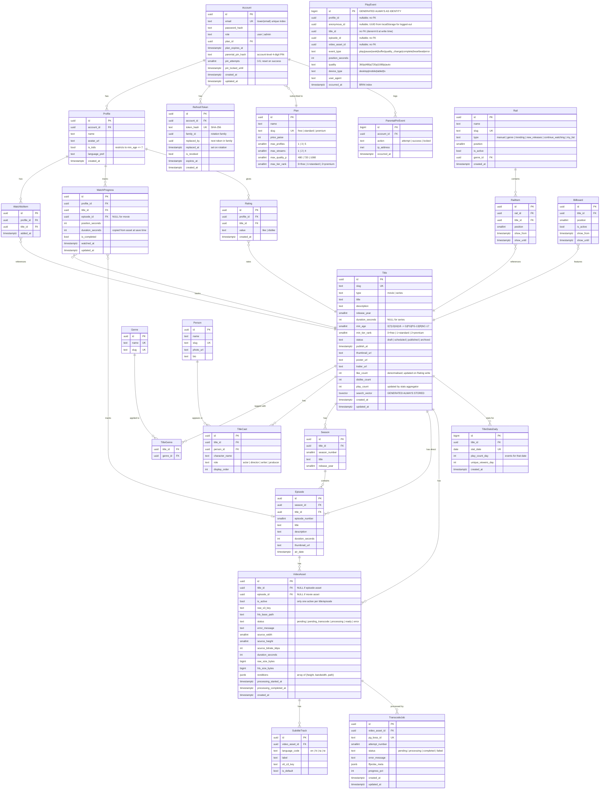

# 05 – Database Design

> ORM: **Prisma 6** · DB: **PostgreSQL 16** (Neon production, Docker locally)  
> Naming: `snake_case` columns · `PascalCase` Prisma models  
> **Key decisions:** `tier_rank` replaces `content_tiers[]`; `min_age` for maturity; account-level parental PIN; refresh-token families; `play_events` is unpartitioned BIGINT; `watch_progress` uses two partial unique indexes.

---

## Entity Relationship Diagram



### Phase 2 Tables (reserved in ERD, not built in MVP)

| Table               | Purpose                                                              |
| ------------------- | -------------------------------------------------------------------- |
| `subscriptions`     | Subscription lifecycle (start, renewal, cancel, grace period)        |
| `payments`          | Payment records, Razorpay order/payment IDs, amounts                 |
| `playback_sessions` | Concurrent stream enforcement; one row per active stream per account |

---

## Table Specifications

### `accounts`

```sql
CREATE TABLE accounts (
  id                UUID        DEFAULT gen_random_uuid() PRIMARY KEY,
  email             TEXT        NOT NULL,
  password_hash     TEXT        NOT NULL,
  role              TEXT        NOT NULL DEFAULT 'user'
                    CHECK (role IN ('user', 'admin')),
  plan_id           UUID        REFERENCES plans(id) ON DELETE SET NULL,
  plan_expires_at   TIMESTAMPTZ,
  -- Account-level parental PIN (not per-profile; see US-504)
  parental_pin_hash TEXT,
  pin_attempts      SMALLINT    NOT NULL DEFAULT 0,
  pin_locked_until  TIMESTAMPTZ,
  created_at        TIMESTAMPTZ NOT NULL DEFAULT now(),
  updated_at        TIMESTAMPTZ NOT NULL DEFAULT now()
);

-- Email uniqueness is case-insensitive
CREATE UNIQUE INDEX uq_accounts_email ON accounts(lower(email));
CREATE INDEX idx_accounts_plan_id ON accounts(plan_id);
```

> **Why `lower(email)` index and not `citext`?** `citext` is an extension that must be enabled before the first `CREATE TABLE`. Using a functional index on `lower(email)` keeps the column type as plain `TEXT` (better Prisma compatibility) while enforcing case-insensitive uniqueness at the DB level. Prisma stores the email pre-lowercased; the index is the guard.

### `plans`

```sql
CREATE TABLE plans (
  id               UUID     DEFAULT gen_random_uuid() PRIMARY KEY,
  name             TEXT     NOT NULL,
  slug             TEXT     NOT NULL UNIQUE,   -- 'free' | 'standard' | 'premium'
  price_paise      INTEGER  NOT NULL DEFAULT 0,
  max_profiles     SMALLINT NOT NULL DEFAULT 1,
  max_streams      SMALLINT NOT NULL DEFAULT 1,
  max_quality_p    SMALLINT NOT NULL DEFAULT 480,  -- max resolution height
  max_tier_rank    SMALLINT NOT NULL DEFAULT 0      -- 0=free, 1=standard, 2=premium
  -- No has_downloads: downloads are out of scope for all tiers (A10)
);

-- Seed (idempotent; use in migration 0002_seed_plans.sql)
INSERT INTO plans (name, slug, price_paise, max_profiles, max_streams, max_quality_p, max_tier_rank)
VALUES
  ('Free',     'free',     0,     1, 1,  480, 0),
  ('Standard', 'standard', 14900, 3, 2,  720, 1),
  ('Premium',  'premium',  24900, 5, 4, 1080, 2)
ON CONFLICT (slug) DO UPDATE
  SET max_profiles = EXCLUDED.max_profiles,
      max_streams  = EXCLUDED.max_streams,
      max_quality_p = EXCLUDED.max_quality_p,
      max_tier_rank = EXCLUDED.max_tier_rank;
```

### `profiles`

```sql
CREATE TABLE profiles (
  id            UUID        DEFAULT gen_random_uuid() PRIMARY KEY,
  account_id    UUID        NOT NULL REFERENCES accounts(id) ON DELETE CASCADE,
  name          TEXT        NOT NULL,
  avatar_url    TEXT,
  is_kids       BOOLEAN     NOT NULL DEFAULT false,
  -- Parental PIN is now account-level (see accounts.parental_pin_hash)
  -- pin_hash removed from profiles
  language_pref TEXT        DEFAULT 'en',
  created_at    TIMESTAMPTZ NOT NULL DEFAULT now()
);

CREATE INDEX idx_profiles_account_id ON profiles(account_id);
```

> **Profile count enforcement:** Done at the application layer (`requireSession()` checks `account.plan.max_profiles`). Not enforced by a DB constraint because the limit can be changed by plan upgrade without a migration.

### `refresh_tokens`

```sql
CREATE TABLE refresh_tokens (
  id           UUID        DEFAULT gen_random_uuid() PRIMARY KEY,
  account_id   UUID        NOT NULL REFERENCES accounts(id) ON DELETE CASCADE,
  token_hash   TEXT        NOT NULL,  -- SHA-256(raw_token); indexed below
  family_id    UUID        NOT NULL,  -- all tokens from the same login share this
  replaced_by  UUID,                  -- pointer to the successor token
  replaced_at  TIMESTAMPTZ,           -- when rotation happened (grace window check)
  is_revoked   BOOLEAN     NOT NULL DEFAULT false,
  expires_at   TIMESTAMPTZ NOT NULL,
  created_at   TIMESTAMPTZ NOT NULL DEFAULT now()
);

CREATE UNIQUE INDEX uq_refresh_tokens_hash ON refresh_tokens(token_hash);
CREATE INDEX idx_refresh_tokens_account ON refresh_tokens(account_id);
CREATE INDEX idx_refresh_tokens_family  ON refresh_tokens(family_id);
-- Cleanup index: DELETE WHERE expires_at < now() AND is_revoked = true
CREATE INDEX idx_refresh_tokens_expired ON refresh_tokens(expires_at)
  WHERE is_revoked = true;
```

### `titles`

```sql
-- Extension (add to first migration)
CREATE EXTENSION IF NOT EXISTS pg_trgm;

CREATE TABLE titles (
  id               UUID        DEFAULT gen_random_uuid() PRIMARY KEY,
  slug             TEXT        NOT NULL UNIQUE,
  type             TEXT        NOT NULL CHECK (type IN ('movie', 'series')),
  title            TEXT        NOT NULL,
  description      TEXT,
  release_year     SMALLINT,
  duration_seconds INTEGER,                   -- NULL for series
  -- Maturity: internal canonical int (0=G, 7=PG, 13=PG-13, 16=R, 18=NC-17)
  -- Display label computed at render time via regional mapping (A11)
  min_age          SMALLINT    NOT NULL DEFAULT 0
                   CHECK (min_age IN (0, 7, 13, 16, 18)),
  -- Access tier: 0=free, 1=standard, 2=premium
  min_tier_rank    SMALLINT    NOT NULL DEFAULT 0
                   CHECK (min_tier_rank IN (0, 1, 2)),
  -- Single publishing rule: published = (status='published' AND publish_at <= now())
  status           TEXT        NOT NULL DEFAULT 'draft'
                   CHECK (status IN ('draft', 'scheduled', 'published', 'archived')),
  publish_at       TIMESTAMPTZ,
  thumbnail_url    TEXT,
  poster_url       TEXT,
  trailer_url      TEXT,
  -- Denormalised counters (updated by stats aggregator or triggers)
  like_count       INTEGER     NOT NULL DEFAULT 0,
  dislike_count    INTEGER     NOT NULL DEFAULT 0,
  play_count       INTEGER     NOT NULL DEFAULT 0,
  -- FTS: hand-edit migration SQL; Prisma schema uses @Unsupported / raw
  search_vector    TSVECTOR    GENERATED ALWAYS AS (
    to_tsvector('english',
      coalesce(title, '') || ' ' ||
      coalesce(description, '')
    )
  ) STORED,
  created_at       TIMESTAMPTZ NOT NULL DEFAULT now(),
  updated_at       TIMESTAMPTZ NOT NULL DEFAULT now()
);

-- Published content (most common query predicate)
CREATE INDEX idx_titles_published ON titles(publish_at DESC)
  WHERE status = 'published';
CREATE INDEX idx_titles_type       ON titles(type);
CREATE INDEX idx_titles_tier_rank  ON titles(min_tier_rank);
CREATE INDEX idx_titles_min_age    ON titles(min_age);   -- kids filtering
CREATE INDEX idx_titles_search     ON titles USING GIN(search_vector);
CREATE INDEX idx_titles_trgm       ON titles USING GIN(title gin_trgm_ops);
-- play_count on title is legacy; Top-10 uses title_stats_daily (7-day window)
```

### `title_stats_daily`

```sql
CREATE TABLE title_stats_daily (
  id                BIGINT      GENERATED ALWAYS AS IDENTITY PRIMARY KEY,
  title_id          UUID        NOT NULL REFERENCES titles(id) ON DELETE CASCADE,
  stat_date         DATE        NOT NULL,
  play_count_day    INTEGER     NOT NULL DEFAULT 0,
  unique_viewers_day INTEGER    NOT NULL DEFAULT 0,
  created_at        TIMESTAMPTZ NOT NULL DEFAULT now(),
  CONSTRAINT uq_title_stats_daily UNIQUE (title_id, stat_date)
);

CREATE INDEX idx_title_stats_date ON title_stats_daily(stat_date DESC, play_count_day DESC);
```

> **Top-10 rail query:** `SELECT title_id, SUM(play_count_day) FROM title_stats_daily WHERE stat_date >= now() - INTERVAL '7 days' GROUP BY title_id ORDER BY SUM(play_count_day) DESC LIMIT 10`. The nightly `stats.worker.ts` aggregates `play_events` into this table.

### `video_assets`

```sql
CREATE TABLE video_assets (
  id                      UUID        DEFAULT gen_random_uuid() PRIMARY KEY,
  -- XOR: either title_id (movie) or episode_id (series ep). Never both NULL.
  -- episode assets also carry title_id for convenience.
  title_id                UUID        REFERENCES titles(id)   ON DELETE CASCADE,
  episode_id              UUID        REFERENCES episodes(id) ON DELETE CASCADE,
  is_active               BOOLEAN     NOT NULL DEFAULT true,
  raw_s3_key              TEXT,
  hls_base_path           TEXT,
  status                  TEXT        NOT NULL DEFAULT 'pending'
                          CHECK (status IN (
                            'pending', 'pending_transcode', 'processing', 'ready', 'error'
                          )),
  error_message           TEXT,
  -- Source metadata (written by ffprobe during transcode)
  source_width            SMALLINT,
  source_height           SMALLINT,
  source_bitrate_kbps     INTEGER,
  duration_seconds        INTEGER,
  raw_size_bytes          BIGINT,
  hls_size_bytes          BIGINT,
  -- Renditions produced: [{height:360, bandwidth:512000, path:"360p/stream.m3u8"}, ...]
  renditions              JSONB,
  processing_started_at   TIMESTAMPTZ,
  processing_completed_at TIMESTAMPTZ,
  created_at              TIMESTAMPTZ NOT NULL DEFAULT now(),

  -- XOR ownership: a movie asset owns a title; an episode asset owns an episode
  -- (episode assets may also have title_id for join convenience, but must have episode_id)
  CONSTRAINT chk_asset_owner CHECK (
    (title_id IS NOT NULL AND episode_id IS NULL) OR
    (episode_id IS NOT NULL)   -- episode assets: episode_id required; title_id optional
  )
);

-- One active asset per title (movie)
CREATE UNIQUE INDEX uq_active_title_asset ON video_assets(title_id)
  WHERE is_active = true AND episode_id IS NULL;

-- One active asset per episode
CREATE UNIQUE INDEX uq_active_episode_asset ON video_assets(episode_id)
  WHERE is_active = true;

CREATE INDEX idx_video_assets_status ON video_assets(status);
```

> **Single source of truth:** `video_assets.status` is the canonical state. `TranscodeJob` is the queue mechanism only — do not read `transcode_jobs.status` for playback decisions; read `video_assets.status = 'ready'`.

### `watch_progress`

```sql
CREATE TABLE watch_progress (
  id               UUID        DEFAULT gen_random_uuid() PRIMARY KEY,
  profile_id       UUID        NOT NULL REFERENCES profiles(id)  ON DELETE CASCADE,
  title_id         UUID        NOT NULL REFERENCES titles(id)    ON DELETE CASCADE,
  episode_id       UUID        REFERENCES episodes(id)           ON DELETE CASCADE,
  position_seconds INTEGER     NOT NULL DEFAULT 0,
  duration_seconds INTEGER     NOT NULL DEFAULT 0, -- copied from asset at write time
  is_completed     BOOLEAN     NOT NULL DEFAULT false,
  watched_at       TIMESTAMPTZ NOT NULL DEFAULT now(),
  updated_at       TIMESTAMPTZ NOT NULL DEFAULT now()
  -- NO nullable composite UNIQUE — Prisma cannot upsert on nullable keys
);

-- Two partial unique indexes instead:
-- Movie progress (no episode): one row per (profile, title)
CREATE UNIQUE INDEX uq_progress_movie
  ON watch_progress(profile_id, title_id)
  WHERE episode_id IS NULL;

-- Episode progress: one row per (profile, episode)
CREATE UNIQUE INDEX uq_progress_episode
  ON watch_progress(profile_id, episode_id)
  WHERE episode_id IS NOT NULL;

CREATE INDEX idx_watch_progress_profile ON watch_progress(profile_id, updated_at DESC);
```

**Upsert pattern (bypass Prisma's broken nullable-key upsert):**

```typescript
// Use $executeRaw — Prisma upsert cannot target partial unique indexes
await db.$executeRaw`
  INSERT INTO watch_progress
    (profile_id, title_id, episode_id, position_seconds, duration_seconds, 
     is_completed, watched_at, updated_at)
  VALUES
    (${profileId}, ${titleId}, ${episodeId ?? null},
     ${positionSeconds}, ${durationSeconds}, ${isCompleted},
     now(), now())
  ON CONFLICT ON CONSTRAINT uq_progress_movie    -- or uq_progress_episode
  DO UPDATE SET
    position_seconds = EXCLUDED.position_seconds,
    duration_seconds = EXCLUDED.duration_seconds,
    is_completed     = EXCLUDED.is_completed,
    watched_at       = EXCLUDED.watched_at,
    updated_at       = now()
`;
// Note: choose the correct constraint name based on whether episodeId is null
```

### `play_events` (append-only analytics)

```sql
CREATE TABLE play_events (
  -- BIGINT identity, not UUID: simpler PK for an append-only table; no UUID overhead
  id              BIGINT       GENERATED ALWAYS AS IDENTITY PRIMARY KEY,
  -- No FK constraints: this is an append-only log; FKs create write contention
  -- and prevent deletion of titles/profiles without cascading into the log
  profile_id      UUID,        -- NULL for anonymous viewers
  anonymous_id    UUID,        -- UUID from client localStorage; set when profile_id IS NULL
  title_id        UUID        NOT NULL,   -- denormalised at write time
  episode_id      UUID,
  video_asset_id  UUID,
  event_type      TEXT        NOT NULL
                  CHECK (event_type IN (
                    'play', 'pause', 'seek', 'buffer', 'quality_change',
                    'complete', 'heartbeat', 'error'
                  )),
  position_seconds INTEGER,
  quality         TEXT,
  device_type     TEXT,
  user_agent      TEXT,
  occurred_at     TIMESTAMPTZ NOT NULL DEFAULT now()
);

-- BRIN index: efficient for time-sorted append-only tables (physical order ≈ time order)
-- Much smaller than B-tree; acceptable for range scans on occurred_at
CREATE INDEX idx_play_events_time    ON play_events USING BRIN(occurred_at);
CREATE INDEX idx_play_events_title   ON play_events(title_id, occurred_at DESC);
-- profile_id index only if analytical queries per-user are needed
-- Omit for now to reduce write overhead; add in Phase 2 if needed
```

> **OQ1 Answered — Partitioning decision:** Do **not** partition in Phase 1. Partitioning adds complexity (partition creation, partition-aware queries, Prisma raw-SQL only), and the benefits only materialise at > 50M rows. Start with the BRIN index and a monthly `DELETE WHERE occurred_at < now() - INTERVAL '90 days'` retention job. Add `PARTITION BY RANGE (occurred_at)` as an expand → backfill → contract migration when you hit sustained 500k+ events/day.

---

## Prisma Schema Notes vs Raw SQL

Prisma generates correct migrations for most columns, but several PostgreSQL features **must be hand-edited** in the migration SQL file after `prisma migrate dev --create-only`:

| Feature                               | Prisma limitation                                 | Solution                                                                       |
| ------------------------------------- | ------------------------------------------------- | ------------------------------------------------------------------------------ |
| `TIMESTAMPTZ`                         | Prisma uses `TIMESTAMP` by default                | Add `@db.Timestamptz(3)` in schema; verify migration SQL                       |
| `GENERATED ALWAYS AS` tsvector        | No Prisma support                                 | Use `Unsupported("tsvector")` in schema; write raw SQL in migration            |
| `GIN` indexes                         | No Prisma support                                 | Add `CREATE INDEX ... USING GIN(...)` after `prisma migrate dev --create-only` |
| `pg_trgm` extension                   | Not in Prisma schema                              | Add `CREATE EXTENSION IF NOT EXISTS pg_trgm;` to first migration               |
| Partial unique indexes                | No Prisma support                                 | Hand-edit migration SQL; use `$executeRaw` for upserts targeting them          |
| `CHECK` constraints                   | Limited support (`@db.Check` not fully supported) | Write `CONSTRAINT chk_... CHECK(...)` in migration SQL                         |
| `BRIN` index                          | No Prisma support                                 | Hand-edit migration SQL                                                        |
| `BIGINT GENERATED ALWAYS AS IDENTITY` | Use `@id @default(autoincrement()) @db.BigInt`    | Verify output in migration SQL                                                 |

**`@updatedAt` caveat:** Prisma's `@updatedAt` only fires on Prisma ORM writes. If you use `$executeRaw` (e.g., for watch_progress upserts), you must set `updated_at = now()` manually in the SQL.

### Example Prisma schema excerpt

```prisma
// prisma/schema.prisma
datasource db {
  provider  = "postgresql"
  url       = env("DATABASE_URL")
  directUrl = env("DATABASE_DIRECT_URL")  // required for prisma migrate + pg-boss worker
}

model Title {
  id            String   @id @default(uuid())
  slug          String   @unique
  type          String
  title         String
  description   String?
  releaseYear   Int?     @map("release_year") @db.SmallInt
  durationSeconds Int?   @map("duration_seconds")
  minAge        Int      @map("min_age")   @db.SmallInt
  minTierRank   Int      @map("min_tier_rank") @db.SmallInt
  status        String   @default("draft")
  publishAt     DateTime? @map("publish_at") @db.Timestamptz(3)
  thumbnailUrl  String?  @map("thumbnail_url")
  posterUrl     String?  @map("poster_url")
  trailerUrl    String?  @map("trailer_url")
  likeCount     Int      @default(0) @map("like_count")
  dislikeCount  Int      @default(0) @map("dislike_count")
  playCount     Int      @default(0) @map("play_count")
  searchVector  Unsupported("tsvector")? @map("search_vector")
  createdAt     DateTime @default(now()) @map("created_at") @db.Timestamptz(3)
  updatedAt     DateTime @updatedAt      @map("updated_at") @db.Timestamptz(3)

  @@map("titles")
}

model PlayEvent {
  id             BigInt   @id @default(autoincrement()) @db.BigInt
  profileId      String?  @map("profile_id") @db.Uuid
  anonymousId    String?  @map("anonymous_id") @db.Uuid
  titleId        String   @map("title_id") @db.Uuid
  // No @relation — play_events has no FK constraints
  // ...
  @@map("play_events")
}
```

---

## Migration Strategy

> **Rule: migrations run in CI/CD, not in the Vercel build step.**

```
┌─────────────────────────────────────────────────────────────────┐
│  Vercel build step:  next build  (NO prisma migrate deploy)     │
│                                                                  │
│  CI/CD pipeline (GitHub Actions):                               │
│    1. prisma migrate deploy --schema=prisma/schema.prisma       │
│       using DATABASE_DIRECT_URL (non-pooled Neon URL)           │
│    2. Run integration tests                                      │
│    3. Deploy to Vercel                                           │
└─────────────────────────────────────────────────────────────────┘
```

| Rule                              | Detail                                                                                                                                                                     |
| --------------------------------- | -------------------------------------------------------------------------------------------------------------------------------------------------------------------------- |
| **`directUrl` for migrations**    | Pooled Neon URLs go through PgBouncer which doesn't support DDL advisory locks. Always use the direct (non-pooled) URL for `prisma migrate deploy`.                        |
| **Shadow DB**                     | Set `shadowDatabaseUrl` in `schema.prisma` for local dev. Neon allows creating a shadow branch. Never use the production DB as shadow.                                     |
| **Expand → backfill → contract**  | For destructive changes (DROP column, rename): (1) Add new column, deploy; (2) Backfill in batches, deploy; (3) Drop old column, deploy. Never combine steps.              |
| **Never edit applied migrations** | Once a migration is applied to any environment, treat it as immutable. Fix forward with a new migration.                                                                   |
| **Hand-edited SQL**               | After `prisma migrate dev --create-only`, open the generated `.sql` and add: GIN indexes, partial indexes, CHECK constraints, extensions, BRIN, GENERATED ALWAYS tsvector. |
| **CI check**                      | `prisma migrate diff --from-schema-datamodel --to-schema-datasource` must return empty on every PR.                                                                        |

---

## Indexes — Full Summary

| Table               | Index                                                   | Type           | Purpose                       |
| ------------------- | ------------------------------------------------------- | -------------- | ----------------------------- |
| `accounts`          | `lower(email)`                                          | Unique B-tree  | Case-insensitive email lookup |
| `accounts`          | `plan_id`                                               | B-tree         | Plan → accounts join          |
| `refresh_tokens`    | `token_hash`                                            | Unique B-tree  | O(1) token lookup             |
| `refresh_tokens`    | `family_id`                                             | B-tree         | Family revocation             |
| `refresh_tokens`    | `expires_at WHERE is_revoked`                           | Partial B-tree | Cleanup job                   |
| `profiles`          | `account_id`                                            | B-tree         | Account → profiles            |
| `titles`            | `publish_at DESC WHERE status='published'`              | Partial B-tree | Public content feed           |
| `titles`            | `min_age`                                               | B-tree         | Kids content filter           |
| `titles`            | `min_tier_rank`                                         | B-tree         | Entitlement filtering         |
| `titles`            | `search_vector`                                         | GIN            | Full-text search              |
| `titles`            | `title gin_trgm_ops`                                    | GIN (trgm)     | Fuzzy / typo search           |
| `title_stats_daily` | `(stat_date DESC, play_count_day DESC)`                 | B-tree         | Top-10 aggregation            |
| `title_stats_daily` | `(title_id, stat_date)`                                 | Unique B-tree  | Upsert by date                |
| `video_assets`      | `title_id WHERE is_active AND episode_id IS NULL`       | Partial Unique | One movie asset               |
| `video_assets`      | `episode_id WHERE is_active`                            | Partial Unique | One episode asset             |
| `watch_progress`    | `(profile_id, title_id) WHERE episode_id IS NULL`       | Partial Unique | Movie upsert                  |
| `watch_progress`    | `(profile_id, episode_id) WHERE episode_id IS NOT NULL` | Partial Unique | Episode upsert                |
| `watch_progress`    | `(profile_id, updated_at DESC)`                         | B-tree         | Continue Watching rail        |
| `watchlist_items`   | `(profile_id, title_id)`                                | Unique B-tree  | Idempotent add                |
| `watchlist_items`   | `(profile_id, added_at DESC)`                           | B-tree         | My List rail                  |
| `play_events`       | `occurred_at`                                           | BRIN           | Time range scans              |
| `play_events`       | `(title_id, occurred_at DESC)`                          | B-tree         | Per-title analytics           |
| `ratings`           | `(profile_id, title_id)`                                | Unique B-tree  | One rating per profile        |

---

## Module Table-Ownership Map

Each table is **owned** by exactly one module. Only the owning module may write to the table. Other modules query via the owner's `index.ts` or a View.

| Module      | Owns                                                                                                                    | Read-by                                                  |
| ----------- | ----------------------------------------------------------------------------------------------------------------------- | -------------------------------------------------------- |
| `auth`      | `accounts`, `refresh_tokens`, `parental_pin_events`                                                                     | `billing`, `profile`                                     |
| `billing`   | `plans`                                                                                                                 | `auth`, `content`, `video`                               |
| `profile`   | `profiles`                                                                                                              | `watchlist`, `analytics`, `recommend`                    |
| `content`   | `titles`, `genres`, `title_genres`, `persons`, `title_cast`, `seasons`, `episodes`, `rails`, `rail_items`, `billboards` | `video`, `search`, `watchlist`, `recommend`, `analytics` |
| `video`     | `video_assets`, `subtitle_tracks`, `transcode_jobs`                                                                     | `content`, `admin`                                       |
| `watchlist` | `watchlist_items`, `watch_progress`, `ratings`                                                                          | `recommend`, `analytics`                                 |
| `analytics` | `play_events`, `title_stats_daily`                                                                                      | `recommend`, `admin`                                     |
| `admin`     | _(no exclusive tables; orchestrates other modules)_                                                                     | all                                                      |
| `recommend` | _(no tables; reads `title_stats_daily`, `watchlist_items`, `ratings`)_                                                  | —                                                        |
| `search`    | _(no tables; reads `titles` via FTS)_                                                                                   | —                                                        |

---

## Seed Data Plan

```typescript
// prisma/seed.ts — idempotent; safe to run multiple times

// Guard: never run seed against production DB
if (process.env.NODE_ENV === 'production') {
  console.error('Seed blocked in production. Set ALLOW_SEED=true to override.')
  if (!process.env.ALLOW_SEED) process.exit(1)
}

// Idempotent upserts by slug / natural key
await db.plan.upsert({ where: { slug: 'free' },  update: {...}, create: {...} })
await db.plan.upsert({ where: { slug: 'standard' }, ... })
await db.plan.upsert({ where: { slug: 'premium' }, ... })

// Admin account (password from env; never hardcoded)
const adminPassword = process.env.SEED_ADMIN_PASSWORD
if (!adminPassword) throw new Error('SEED_ADMIN_PASSWORD env var required')
await db.account.upsert({
  where: { email: 'admin@streamforge.dev' },
  update: {},
  create: { email: 'admin@streamforge.dev', passwordHash: await hashPassword(adminPassword), role: 'admin', planId: premiumPlan.id }
})

// Shared sample HLS asset (CC BY Blender Foundation)
// Points to a pre-seeded MinIO path: videos/seed-bbb/hls/master.m3u8
// Script: npm run seed:media copies the sample HLS to local MinIO
const sampleHlsPath = 'videos/seed-bbb/hls'

// Titles upserted by slug; video assets upserted by (title_id, is_active)
```

**`seed:media` script** (`scripts/seed-media.ts`):

- Downloads Big Buck Bunny pre-transcoded HLS from a known public URL (CC BY 3.0)
- Uploads segments to local MinIO at `videos/seed-bbb/hls/`
- Attribution: © Blender Foundation | www.blender.org — CC BY 3.0

---

## Data Retention & Deletion

| Table                 | Retention policy                           | Mechanism                                                                                       |
| --------------------- | ------------------------------------------ | ----------------------------------------------------------------------------------------------- |
| `play_events`         | 90 days rolling                            | Nightly pg-boss job: `DELETE WHERE occurred_at < now() - INTERVAL '90 days'`                    |
| `refresh_tokens`      | Delete on expiry or revocation             | Nightly pg-boss job: `DELETE WHERE expires_at < now() - INTERVAL '1 day' AND is_revoked = true` |
| `watch_progress`      | Kept indefinitely (small)                  | Manual delete only                                                                              |
| `parental_pin_events` | 30 days                                    | Nightly cleanup                                                                                 |
| `raw-uploads/` (S3)   | Delete after transcode                     | Worker deletes on successful transcode; R2 lifecycle aborts incomplete multiparts after 24 h    |
| GDPR account deletion | All profile data + play_events(profile_id) | Soft-delete account (`deleted_at`) + scheduled hard-delete job at 30 days                       |

---

## Extensions Required

```sql
-- Migration: 0001_extensions.sql (always the first migration)
CREATE EXTENSION IF NOT EXISTS pg_trgm;    -- trigram fuzzy search
CREATE EXTENSION IF NOT EXISTS pgcrypto;   -- gen_random_bytes for token generation
-- gen_random_uuid() is built into Postgres 16 (no uuid-ossp needed)

-- Phase 2:
-- CREATE EXTENSION IF NOT EXISTS vector;  -- pgvector for recommendation embeddings
```

---

## Open Questions

| #   | Status    | Question                                          | Decision                                                                                                                               |
| --- | --------- | ------------------------------------------------- | -------------------------------------------------------------------------------------------------------------------------------------- |
| OQ1 | ✅ Closed | `play_events` partitioned from day 1?             | **No.** Unpartitioned + BRIN + retention job. Add partitioning at > 50M rows via expand→contract.                                      |
| OQ2 | Open      | Separate `tags` table (free-form) vs genres only? | Defer to Phase 2; genres are sufficient for MVP                                                                                        |
| OQ3 | ✅ Closed | Star ratings vs like/dislike only?                | **Like/dislike for MVP** (stored in `ratings` table; `like_count`/`dislike_count` denormalised on `titles`). Star ratings are Phase 2. |

---

## Risks

| Risk                                                       | Impact | Mitigation                                                                          |
| ---------------------------------------------------------- | ------ | ----------------------------------------------------------------------------------- |
| `@updatedAt` not fired on raw SQL upserts                  | Low    | Always include `updated_at = now()` in `$executeRaw`                                |
| Hand-edited migration SQL diverges from Prisma schema      | Medium | `prisma migrate diff` in CI must return empty; review checklist                     |
| BRIN on `play_events` too coarse for small event counts    | Low    | Acceptable in Phase 1; add B-tree on `(title_id, occurred_at)` if aggregation slows |
| Partial unique indexes not surfaced in Prisma client       | Medium | Document in DAL; use `$executeRaw` for `ON CONFLICT ON CONSTRAINT` upserts          |
| `lower(email)` index not enforced by Prisma at model level | Low    | Middleware normalises email to lowercase before every write; index is the DB guard  |
