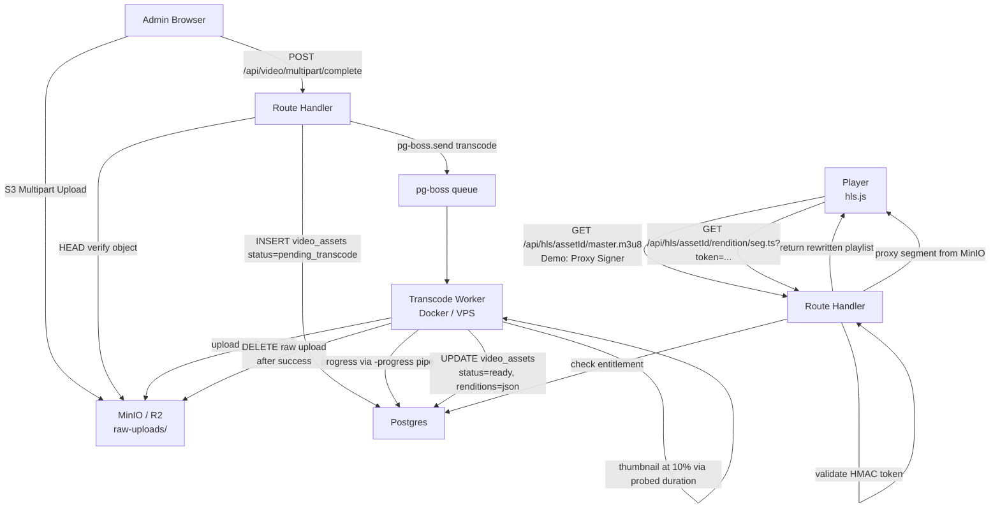

# 07 – Video Pipeline

> **Stack:** FFmpeg · pg-boss · hls.js · MinIO (local) / Cloudflare R2 (prod)  
> **Signing strategy:** Demo = manifest proxy route handler (manifest rewrite); Prod = HMAC edge token, cache key excludes token.  
> **AI Pipeline** moved to [`docs/future/ai-content-pipeline.md`](./future/ai-content-pipeline.md).

---

## Pipeline Overview



---

## Bitrate Ladder

| Rendition | Video Bitrate | Audio Bitrate | Profile / Level | Target Use            |
| --------- | ------------- | ------------- | --------------- | --------------------- |
| 360p      | 400 kbps      | 64 kbps       | baseline / 3.0  | Mobile, slow networks |
| 480p      | 900 kbps      | 96 kbps       | main / 3.1      | Standard mobile       |
| 720p      | 2500 kbps     | 128 kbps      | main / 4.0      | Desktop / Fast mobile |
| 1080p     | 5000 kbps     | 192 kbps      | high / 4.1      | Premium / TV          |

**BANDWIDTH in master.m3u8** = video bitrate + audio bitrate (in bits/s). E.g., 360p → `BANDWIDTH=464000`.

---

## Source Probe & Rendition Selection

Before invoking FFmpeg, the worker runs `ffprobe` to determine source dimensions and duration:

```typescript
// workers/transcode.worker.ts
import { execFileSync } from 'child_process'

interface FfprobeResult {
  sourceHeight: number
  sourceWidth: number
  durationSeconds: number
  videoBitrate: number
  hasAudio: boolean
}

function probeInput(inputPath: string): FfprobeResult {
  const raw = execFileSync('ffprobe', [
    '-v',
    'error',
    '-select_streams',
    'v:0',
    '-show_entries',
    'stream=width,height,bit_rate:format=duration',
    '-of',
    'json',
    inputPath,
  ])
  const info = JSON.parse(raw.toString())
  const stream = info.streams[0]
  const hasAudio = execFileSync('ffprobe', [
    '-v',
    'error',
    '-select_streams',
    'a:0',
    '-show_entries',
    'stream=codec_type',
    '-of',
    'json',
    inputPath,
  ])
    .toString()
    .includes('audio')

  return {
    sourceHeight: stream.height,
    sourceWidth: stream.width,
    durationSeconds: Math.ceil(parseFloat(info.format.duration)),
    videoBitrate: parseInt(stream.bit_rate ?? '0'),
    hasAudio,
  }
}

const BITRATE_LADDER = [
  {
    height: 360,
    vbr: '400k',
    vmax: '440k',
    vbuf: '800k',
    abr: '64k',
    profile: 'baseline',
    level: '3.0',
  },
  {
    height: 480,
    vbr: '900k',
    vmax: '990k',
    vbuf: '1800k',
    abr: '96k',
    profile: 'main',
    level: '3.1',
  },
  {
    height: 720,
    vbr: '2500k',
    vmax: '2750k',
    vbuf: '5000k',
    abr: '128k',
    profile: 'main',
    level: '4.0',
  },
  {
    height: 1080,
    vbr: '5000k',
    vmax: '5500k',
    vbuf: '10000k',
    abr: '192k',
    profile: 'high',
    level: '4.1',
  },
]

// Skip renditions above source height (no upscaling)
function selectRenditions(sourceHeight: number) {
  return BITRATE_LADDER.filter((r) => r.height <= sourceHeight)
}
```

---

## FFmpeg Transcode Command

```typescript
function buildFfmpegArgs(
  inputPath: string,
  outputDir: string,
  renditions: typeof BITRATE_LADDER,
  durationSeconds: number,
  hasAudio: boolean,
): string[] {
  const filterParts: string[] = []
  const maps: string[] = []
  const perStream: string[] = []

  // Split video into N renditions
  filterParts.push(`[0:v]split=${renditions.length}${renditions.map((_, i) => `[v${i}]`).join('')}`)
  renditions.forEach((r, i) => {
    filterParts.push(`[v${i}]scale=-2:${r.height}[s${i}]`)
  })

  renditions.forEach((r, i) => {
    maps.push('-map', `[s${i}]`)
    if (hasAudio) maps.push('-map', '0:a:0') // explicit audio map per output

    perStream.push(
      `-c:v:${i}`,
      'libx264',
      `-b:v:${i}`,
      r.vbr,
      `-maxrate:v:${i}`,
      r.vmax,
      `-bufsize:v:${i}`,
      r.vbuf,
      `-profile:v:${i}`,
      r.profile,
      `-level:v:${i}`,
      r.level,
      `-pix_fmt`,
      'yuv420p',
    )
    if (hasAudio) {
      perStream.push(`-c:a:${i}`, 'aac', `-b:a:${i}`, r.abr)
    }
  })

  const varStreamMap = renditions.map((_, i) => (hasAudio ? `v:${i},a:${i}` : `v:${i}`)).join(' ')

  // Segment TTL = duration + 1h; this is used when signing segment URLs
  const segmentTtl = durationSeconds + 3600

  return [
    // FFmpeg input hardening:
    // 1. Restrict protocols to file, pipe, and crypto only (blocks SSRF to http/gopher/subfile/concat)
    '-protocol_whitelist',
    'file,pipe,crypto',
    // 2. Force demuxer to mp4 to prevent container format misinterpretation attacks
    '-f',
    'mp4',
    '-i',
    inputPath,
    '-filter_complex',
    filterParts.join(';'),
    ...maps,
    ...perStream,
    // Aligned keyframes every 2s (forces I-frame at segment boundaries)
    '-force_key_frames',
    'expr:gte(t,n_forced*2)',
    '-hls_time',
    '4',
    '-hls_playlist_type',
    'vod',
    '-hls_flags',
    'independent_segments', // each segment is independently decodable
    '-hls_segment_type',
    'mpegts',
    '-var_stream_map',
    varStreamMap,
    '-master_pl_name',
    'master.m3u8',
    '-hls_segment_filename',
    `${outputDir}/%v/seg_%04d.ts`,
    `${outputDir}/%v/stream.m3u8`,
  ]
}

/**
 * Validates MP4 ISO container magic bytes prior to invoking FFmpeg.
 * Bytes 4..7 must equal 'ftyp'.
 */
export async function validateMp4MagicBytes(filePath: string): Promise<boolean> {
  const fs = await import('fs/promises')
  const fh = await fs.open(filePath, 'r')
  const buf = Buffer.alloc(8)
  await fh.read(buf, 0, 8, 0)
  await fh.close()
  return buf.subarray(4, 8).toString('ascii') === 'ftyp'
}
```

**Correct `scale=-2:H`:** Width is computed by FFmpeg to preserve aspect ratio; the `-2` ensures it rounds to an even number (required by libx264 for yuv420p).

**FFmpeg output structure:**

```
/var/lib/streamforge/scratch/{assetId}/
├── master.m3u8
├── 0/   (360p)
│   ├── stream.m3u8
│   ├── seg_0000.ts
│   └── ...
├── 1/   (480p)
├── 2/   (720p)
└── 3/   (1080p, only if source_height >= 1080)
```

---

## HLS Access Control & Signing Strategy

### StreamUrlSigner interface

```typescript
// src/modules/video/signing.ts

export interface StreamUrlSigner {
  /**
   * Returns a URL for the master playlist that the player should load.
   * In demo mode: a route handler URL with a short-lived HMAC token.
   * In prod mode: a CDN URL with an HMAC token (cache key excludes token).
   */
  signMasterUrl(assetId: string, profileId: string | null, opts?: SignOptions): Promise<string>

  /**
   * Rewrites a raw variant playlist so all .ts segment URIs become signed absolute URLs.
   * @param rawContent - the playlist content as stored in MinIO
   * @param segmentTtl - seconds until segment URLs expire (>= contentDuration + 3600)
   */
  rewriteVariantPlaylist(
    assetId: string,
    rendition: string,
    rawContent: string,
    segmentTtl: number,
  ): Promise<string>

  /** Validates a segment token; throws if invalid or expired */
  validateSegmentToken(assetId: string, segmentKey: string, token: string, exp: string): void
}

interface SignOptions {
  /** Seconds until the master URL expires. Default: 3600 */
  masterTtl?: number
}
```

### Demo: Manifest Proxy Signer (Phase 1)

All HLS content is proxied through a Next.js Route Handler. MinIO bucket **is not** publicly accessible.

```
Browser → GET /api/hls/{assetId}/master.m3u8?token=HMAC&exp=UNIX
         ↓ (Route Handler validates token, checks entitlement, reads master from MinIO)
         → rewrites variant playlist URIs:
              0/stream.m3u8  →  /api/hls/{assetId}/0/stream.m3u8?token=...
         ↓ returns rewritten master to browser
Browser → GET /api/hls/{assetId}/0/stream.m3u8?token=HMAC&exp=UNIX
         ↓ (Route Handler validates token, reads variant from MinIO)
         → rewrites .ts segment URIs:
              seg_0001.ts  →  /api/hls/{assetId}/0/seg_0001.ts?token=HMAC(assetId,seg_key,exp)&exp=UNIX
         ↓ returns rewritten variant playlist
Browser → GET /api/hls/{assetId}/0/seg_0001.ts?token=...&exp=...
         ↓ (Route Handler validates per-segment HMAC, streams from MinIO)
```

```typescript
// src/modules/video/signing-demo.ts
import { createHmac, timingSafeEqual } from 'crypto'

const SIGNING_SECRET = env.HLS_SIGNING_SECRET // 32-byte hex string from .env

function hmacSign(payload: string, ttlSeconds: number): { token: string; exp: number } {
  const exp = Math.floor(Date.now() / 1000) + ttlSeconds
  const token = createHmac('sha256', SIGNING_SECRET).update(`${payload}:${exp}`).digest('hex')
  return { token, exp }
}

function hmacVerify(payload: string, token: string, exp: string): boolean {
  const expNum = parseInt(exp)
  if (Date.now() / 1000 > expNum) return false // expired
  const expected = createHmac('sha256', SIGNING_SECRET).update(`${payload}:${exp}`).digest('hex')
  return timingSafeEqual(Buffer.from(token), Buffer.from(expected))
}

// Segment TTL = content duration + 1 hour buffer
// This prevents expiry mid-watch for any reasonable content length
export function segmentTtl(durationSeconds: number): number {
  return durationSeconds + 3600
}
```

**Route Handler:**

```typescript
// src/app/api/hls/[assetId]/[...path]/route.ts
export async function GET(
  req: Request,
  { params }: { params: { assetId: string; path: string[] } },
) {
  const { assetId, path } = params
  const { searchParams } = new URL(req.url)
  const token = searchParams.get('token')
  const exp = searchParams.get('exp')
  const qMax = parseInt(searchParams.get('qMax') ?? '2160', 10) // Max allowed quality height (e.g. 480, 720, 1080)
  const pathStr = path.join('/')

  // 1. Verify HMAC token (signing covers assetId, path, exp, and qMax entitlement)
  const payloadToVerify = `${assetId}:${pathStr}:${qMax}`
  if (!token || !exp || !hmacVerify(payloadToVerify, token, exp)) {
    return new Response('Forbidden', { status: 403 })
  }

  // 2. Direct Quality Enforcement:
  // Reject requests for disallowed variant playlists or segments if above qMax
  // e.g. path = ['2', 'stream.m3u8'] where variant 2 is 720p but qMax is 480p
  const variantIndex = parseInt(path[0], 10)
  if (!isNaN(variantIndex)) {
    const variantHeight = getVariantHeightByIndex(variantIndex) // 0=360, 1=480, 2=720, 3=1080, 4=2160
    if (variantHeight > qMax) {
      return new Response('Forbidden: Quality Exceeds Plan Entitlement', { status: 403 })
    }
  }

  // 3. Fetch from MinIO (internal; bucket not public)
  const content = await storage.getObject(`videos/${assetId}/hls/${pathStr}`)

  // 4. If master playlist: filter variants above qMax and rewrite URIs
  if (pathStr === 'master.m3u8') {
    const filteredAndRewritten = await signer.rewriteMasterPlaylist(assetId, content, {
      maxQualityP: qMax,
      tokenExp: exp,
    })
    return new Response(filteredAndRewritten, {
      headers: { 'Content-Type': 'application/vnd.apple.mpegurl', 'Cache-Control': 'no-store' },
    })
  }

  // 5. If variant playlist: rewrite segment URIs; if segment: stream through
  if (pathStr.endsWith('.m3u8')) {
    const rewritten = await signer.rewriteVariantPlaylist(assetId, path[0], content, exp, qMax)
    return new Response(rewritten, {
      headers: { 'Content-Type': 'application/vnd.apple.mpegurl', 'Cache-Control': 'no-store' },
    })
  }

  return new Response(content, {
    headers: {
      'Content-Type': 'video/mp2t',
      'Cache-Control': 'no-store', // segments are signed; no CDN caching in demo
    },
  })
}
```

### Production: HMAC Edge Token (Phase 2+)

In production with a CDN (Cloudflare Workers):

1. **Signed URLs on R2**: `https://cdn.streamforge.dev/videos/{assetId}/hls/0/seg_0001.ts?token=HMAC&exp=UNIX`
2. **Cache key excludes `token` and `exp`**: Cloudflare Worker strips these params before caching (`cacheKey = url.pathname`). The segment content is the same regardless of token — only the delivery permission varies.
3. **Segment TTL**: `durationSeconds + 3600`. After this time, the player would need to re-request the playback API for fresh signed URLs.
4. **Master/variant playlists**: Served via the Route Handler (never cached on CDN) so they can be freshly rewritten with new signed segment URLs.

### Caching Table

| Object                    | Demo caching               | Prod caching                              | TTL    |
| ------------------------- | -------------------------- | ----------------------------------------- | ------ |
| `master.m3u8`             | `no-store` (Route Handler) | `no-store` (Route Handler)                | n/a    |
| `*/stream.m3u8` (variant) | `no-store` (Route Handler) | `no-store` (Route Handler)                | n/a    |
| `*.ts` segments           | `no-store` (Route Handler) | CDN immutable (cache key = pathname only) | 1 year |
| Thumbnails / posters      | CDN public                 | CDN public                                | 1 year |
| Subtitle `.vtt`           | `no-store` (Route Handler) | Signed URL, short-lived                   | 4 h    |

---

## Storage Layout (MinIO / R2)

```
bucket: streamforge-media   [NOT publicly accessible in demo mode]
├── raw-uploads/
│   └── {assetId}.mp4          ← deleted after successful transcode
├── videos/
│   └── {assetId}/
│       └── hls/
│           ├── master.m3u8
│           ├── 0/             ← 360p (always present)
│           │   ├── stream.m3u8
│           │   ├── seg_0000.ts
│           │   └── ...
│           ├── 1/             ← 480p
│           ├── 2/             ← 720p (skipped if source < 720)
│           ├── 3/             ← 1080p (skipped if source < 1080)
│           └── poster.jpg     ← frame at 10% of probed duration
├── subtitles/
│   └── {assetId}/
│       ├── en.vtt
│       ├── hi.vtt
│       └── ta.vtt
└── thumbnails/
    └── {titleId}/
        ├── thumbnail.jpg      ← 16:9, 1280×720
        └── poster.jpg         ← 2:3 portrait, 500×750
```

**Object `Content-Type` and `Cache-Control` on upload (set at `PutObject` time):**

| Object           | Content-Type                    | Cache-Control                         |
| ---------------- | ------------------------------- | ------------------------------------- |
| `*.m3u8`         | `application/vnd.apple.mpegurl` | `no-store` (playlists change)         |
| `*.ts`           | `video/mp2t`                    | `public, max-age=31536000, immutable` |
| `*.jpg / *.webp` | `image/jpeg` / `image/webp`     | `public, max-age=31536000, immutable` |
| `*.vtt`          | `text/vtt`                      | `no-store` (served signed)            |

---

## Transcode Worker

```typescript
// workers/transcode.worker.ts
import PgBoss from 'pg-boss'

// pg-boss v9+: 'work' options API
boss.work(
  'transcode',
  {
    teamSize: 2,
    teamConcurrency: 1,
    // Long expiry: a 2h transcode must not expire before completion
    // pg-boss v9: expireInSeconds (not expireIn)
    expireInSeconds: 7200, // 2 hours
  },
  async (job) => {
    const { assetId } = job.data as { assetId: string }
    const isLastAttempt = job.retryCount >= (job.retryLimit ?? 3) - 1

    // 1. ffprobe input
    await db.transcodeJob.update({
      where: { pgBossId: job.id },
      data: { status: 'processing', attemptNumber: job.retryCount + 1 },
    })

    const probe = probeInput(`/tmp/${assetId}.mp4`)
    await db.videoAsset.update({
      where: { id: assetId },
      data: {
        status: 'processing',
        sourceWidth: probe.sourceWidth,
        sourceHeight: probe.sourceHeight,
        sourceBitrateKbps: Math.round(probe.videoBitrate / 1000),
        durationSeconds: probe.durationSeconds,
        processingStartedAt: new Date(),
      },
    })

    const renditions = selectRenditions(probe.sourceHeight)
    const outputDir = `/tmp/hls-${assetId}`

    // 2. Download raw file from MinIO
    await downloadFromMinIO(`raw-uploads/${assetId}.mp4`, `/tmp/${assetId}.mp4`)

    // 3. FFmpeg with -progress for live progress reporting
    await runFfmpegWithProgress(
      buildFfmpegArgs(
        `/tmp/${assetId}.mp4`,
        outputDir,
        renditions,
        probe.durationSeconds,
        probe.hasAudio,
      ),
      probe.durationSeconds,
      async (pct) => {
        await db.transcodeJob.update({
          where: { pgBossId: job.id },
          data: { progressPct: pct },
        })
      },
    )

    // 4. Poster frame at 10% of probed duration (not guessed)
    const posterTimestamp = Math.floor(probe.durationSeconds * 0.1)
    await execFile('ffmpeg', [
      '-ss',
      String(posterTimestamp),
      '-i',
      `/tmp/${assetId}.mp4`,
      '-vf',
      'scale=-2:720',
      '-frames:v',
      '1',
      '-q:v',
      '2',
      `${outputDir}/poster.jpg`,
    ])
    // Sprite thumbnails deferred to Phase 2 (OQ3 closed)

    // 5. Set Content-Type + Cache-Control on upload
    await uploadHLSDir(assetId, outputDir, renditions)
    // uploadHLSDir sets:
    //   *.m3u8 → Content-Type: application/vnd.apple.mpegurl; Cache-Control: no-store
    //   *.ts   → Content-Type: video/mp2t; Cache-Control: public,max-age=31536000,immutable
    //   *.jpg  → Content-Type: image/jpeg; Cache-Control: public,max-age=31536000,immutable

    // 6. Write renditions metadata to DB
    const renditionsMeta = renditions.map((r, i) => ({
      height: r.height,
      bandwidth: (parseInt(r.vbr) + parseInt(r.abr)) * 1000, // bits/s for BANDWIDTH tag
      path: `${i}/stream.m3u8`,
    }))

    const hlsSize = await measureHlsDirSize(outputDir)

    await db.videoAsset.update({
      where: { id: assetId },
      data: {
        status: 'ready',
        hlsBasePath: `videos/${assetId}/hls/`,
        hlsSizeBytes: BigInt(hlsSize),
        renditions: renditionsMeta,
        processingCompletedAt: new Date(),
      },
    })

    await db.transcodeJob.update({ where: { pgBossId: job.id }, data: { status: 'completed' } })

    // 7. Delete raw upload (configurable)
    if (process.env.DELETE_RAW_AFTER_TRANSCODE !== 'false') {
      await deleteFromMinIO(`raw-uploads/${assetId}.mp4`)
    }

    // 8. Cleanup tmp
    await rmDir(outputDir)
    await rmFile(`/tmp/${assetId}.mp4`)
  },
)

// Error handling: only mark asset as 'error' on final attempt
boss.on('failed', async ({ job }) => {
  if (job.name !== 'transcode') return
  const isLast = job.retryCount >= (job.retryLimit ?? 3)
  if (isLast) {
    const { assetId } = job.data as { assetId: string }
    await db.videoAsset.update({
      where: { id: assetId },
      data: { status: 'error', errorMessage: job.output?.message ?? 'Unknown error' },
    })
    await db.transcodeJob.update({
      where: { pgBossId: job.id },
      data: { status: 'failed', errorMessage: job.output?.message },
    })
  }
  // On non-final attempts: pg-boss retries automatically; keep status='processing'
})
```

**Container limits (Dockerfile.worker):**

```dockerfile
FROM node:20-alpine
RUN apk add --no-cache ffmpeg
# Process-level timeout enforced via pg-boss expireInSeconds
# Container-level: Docker --cpus and --memory flags in compose
WORKDIR /app
COPY workers/ ./workers/
COPY src/lib/ ./src/lib/
RUN npm ci --production
CMD ["node", "workers/index.js"]
```

**docker-compose.yml resource & storage limits:**

```yaml
worker:
  deploy:
    resources:
      limits:
        cpus: '2.0' # leave headroom for Postgres and MinIO
        memory: '2G'
  volumes:
    # Bounded disk volume sized for 10 GB sources (~50 GB disk scratch space, never RAM/tmpfs)
    - worker-scratch:/var/lib/streamforge/scratch
  networks:
    - allowlisted-egress # egress restricted strictly to MinIO/R2 and Postgres pooler

volumes:
  worker-scratch:
    driver: local
```

---

## Thumbnails

```typescript
// Poster at 10% of probed duration (not "thumbnail" filter — that scans for best frame)
const posterTimestamp = Math.floor(probe.durationSeconds * 0.1)

await execFile('ffmpeg', [
  '-ss',
  String(posterTimestamp),
  '-i',
  inputPath,
  '-vf',
  'scale=-2:720', // scale=-2:H preserves aspect ratio, even width
  '-frames:v',
  '1',
  '-q:v',
  '2', // JPEG quality ~90%
  outputPosterPath,
])
```

> **OQ3 closed:** Sprite-based seek preview (10×10 grid) is deferred to Phase 2. The seek bar will use the poster frame as a static preview in Phase 1.

---

## hls.js Player Configuration

```typescript
// src/components/player/VideoPlayer.tsx  ('use client')
import Hls from 'hls.js'

const HLS_CONFIG: Partial<Hls.Config> = {
  // VoD-optimised ABR: longer averaging windows, earlier quality step-up
  abrEwmaFastVoD: 4.0, // fast EWMA window (seconds) for VoD
  abrEwmaSlowVoD: 15.0, // slow EWMA window for VoD
  abrBandWidthFactor: 0.95, // use 95% of estimated bandwidth (conservative)
  abrBandWidthUpFactor: 0.7, // require 70% of next level's bandwidth before upgrading

  // Buffer
  maxBufferLength: 60, // seconds of forward buffer
  maxMaxBufferLength: 120, // cap
  maxBufferSize: 60 * 1024 * 1024, // 60 MB

  // Start auto; let ABR pick the right rendition
  startLevel: -1,

  // Retry
  manifestLoadingMaxRetry: 3,
  levelLoadingMaxRetry: 4,
  fragLoadingMaxRetry: 6,

  // Signed URLs — no cookies; no withCredentials
  // xhrSetup is NOT set: credentials would fail on cross-origin MinIO/R2 requests
}

function initPlayer(
  videoEl: HTMLVideoElement,
  masterUrl: string,
  onLevelsLoaded?: (levels: Array<{ index: number; height: number; label: string }>) => void,
) {
  if (Hls.isSupported()) {
    const hls = new Hls(HLS_CONFIG)
    hls.loadSource(masterUrl)
    hls.attachMedia(videoEl)

    // Dynamic Quality Menu: Built strictly from the parsed manifest, never hardcoded
    hls.on(Hls.Events.MANIFEST_PARSED, (_event, data) => {
      const parsedLevels = data.levels.map((lvl, idx) => ({
        index: idx,
        height: lvl.height,
        label: `${lvl.height}p`,
      }))
      onLevelsLoaded?.(parsedLevels)
    })

    return hls
  }
  // Native HLS fallback (Safari, iOS — supports HLS natively via <video src>)
  if (videoEl.canPlayType('application/vnd.apple.mpegurl')) {
    videoEl.src = masterUrl
    // Native HLS on Safari will follow the master.m3u8 and request signed segments
    // Signed URLs work without cookies
  }
}
```

**Subtitles — `<track>` element (not HLS in-manifest):**

```typescript
// Subtitle tracks injected as <track> elements after player mounts
// This is simpler than HLS EXT-X-MEDIA:TYPE=SUBTITLES and works with hls.js natively
function addSubtitleTracks(videoEl: HTMLVideoElement, subtitles: SubtitleTrack[]) {
  subtitles.forEach((sub, i) => {
    const track = document.createElement('track')
    track.kind = 'subtitles'
    track.label = sub.label
    track.srclang = sub.languageCode
    track.src = sub.signedVttUrl // 4h signed URL from playback API
    track.default = sub.isDefault
    videoEl.appendChild(track)
  })
}
```

**Bucket CORS configuration (required for `<track>` VTT loading cross-origin):**

```json
// MinIO / R2 CORS policy on the bucket
{
  "CORSRules": [
    {
      "AllowedOrigins": ["http://localhost:3000", "https://streamforge.dev"],
      "AllowedMethods": ["GET", "HEAD"],
      "AllowedHeaders": ["*"],
      "MaxAgeSeconds": 3600
    }
  ]
}
```

> The `.ts` segments in demo mode are served via the Route Handler, so CORS doesn't apply to them. CORS is only needed for VTT files if served directly from the bucket. In demo mode, VTT can also be proxied through the Route Handler, in which case CORS is not needed at all.

---

## Playback Entitlement Gate

```mermaid
flowchart TD
    A["GET /api/hls/assetId/master.m3u8?token=..."] --> B{HMAC token valid?}
    B -->|No / expired| Z1[403 Forbidden]
    B -->|Yes| C{Asset status = 'ready'?}
    C -->|No| Z2["404 / 503 ASSET_NOT_READY"]
    C -->|Yes| D{Title status = 'published'\nAND publish_at <= now?}
    D -->|No| Z3["404 NOT_FOUND"]
    D -->|Yes| E{Is kids-safe request\n(profile.is_kids)?}
    E -->|Yes| F{title.min_age <= 7?}
    F -->|No| Z4["403 KIDS_RESTRICTED"]
    F -->|Yes| G
    E -->|No| G{Is user authenticated?}
    G -->|No| H{title.min_tier_rank = 0\n(free content)?}
    H -->|No| Z5["401 LOGIN_REQUIRED"]
    H -->|Yes| I["Sign HLS at 480p cap\n(anonymous free playback)"]
    G -->|Yes| J{plan.max_tier_rank >= title.min_tier_rank?}
    J -->|No| Z6["403 ENTITLEMENT_ERROR\n+ upgrade payload"]
    J -->|Yes| K{plan_expires_at > now\nor plan='free'?}
    K -->|No| Z7["402 PLAN_EXPIRED"]
    K -->|Yes| L["Sign HLS at plan.max_quality_p cap\nReturn master.m3u8 + subtitle URLs"]
```

---

## DRM – Production Upgrade Path

> **hls.js supports EME (Encrypted Media Extensions)** — you do not need to switch to Shaka Player to add DRM. Shaka is an alternative, not a requirement.

| Component    | Phase 1                      | Phase 2 (DRM)                                                               |
| ------------ | ---------------------------- | --------------------------------------------------------------------------- |
| Encryption   | None (HMAC URL signing only) | AES-128 per-segment (`EXT-X-KEY`) or CENC                                   |
| Key server   | N/A                          | Key endpoint: `/api/hls/key/{assetId}` (entitlement check → return AES key) |
| Player       | hls.js (current)             | hls.js + EME config **or** Shaka Player                                     |
| Manifest     | Plain HLS                    | HLS + `EXT-X-KEY:METHOD=AES-128,URI=...,IV=...`                             |
| Key rotation | N/A                          | Per-rendition or per-session                                                |

Steps to add DRM:

1. Add `EXT-X-KEY` to `.ts` segments during transcode (FFmpeg `-hls_key_info_file`)
2. Serve key via authenticated endpoint (entitlement check per request)
3. hls.js `loader` config can intercept key requests to add auth headers

---

## Subtitle Pipeline

```
Admin upload .srt/.vtt → POST /api/admin/content/[id]/subtitles
                       → if .srt: worker converts to .vtt (ffmpeg -i sub.srt sub.vtt)
                       → stored at subtitles/{assetId}/{lang}.vtt
                       → SubtitleTrack record created in DB
                       → playback API returns signed VTT URLs (4h) alongside hlsUrl
```

VTT in-manifest (`EXT-X-MEDIA:TYPE=SUBTITLES`) is Phase 2; Phase 1 uses `<track>` injection.

---

## Seed Media Script

```typescript
// scripts/seed-media.ts  (npm run seed:media)
// Downloads pre-transcoded Big Buck Bunny HLS (CC BY 3.0, Blender Foundation)
// and uploads to local MinIO at videos/seed-bbb/hls/

const BBB_HLS_BASE = 'https://commondatastorage.googleapis.com/gtv-videos-bucket/sample/'
// Attribution: © copyright 2008, Blender Foundation | www.blender.org
// Licensed under CC BY 3.0: https://creativecommons.org/licenses/by/3.0/

async function seedMedia() {
  // Check MinIO is reachable
  // Download BBB 360p sample MP4, transcode locally if not cached
  // Upload resulting HLS to local MinIO under videos/seed-bbb/hls/
  // Upsert video_asset in DB pointing to seed-bbb
  // Run only if seed-bbb/master.m3u8 not already present
}
```

---

## Open Questions

| #   | Status    | Question                              | Decision                                                                                                                          |
| --- | --------- | ------------------------------------- | --------------------------------------------------------------------------------------------------------------------------------- |
| OQ1 | ✅ Closed | HLS from MinIO directly or CDN proxy? | **Demo:** Route Handler proxy (no public bucket). **Prod:** Cloudflare R2 + Worker edge validation.                               |
| OQ2 | ✅ Closed | Worker VPS or Vercel Cron?            | **Always-on Docker service** (VPS in prod; compose in dev). Vercel 60s limit is insufficient.                                     |
| OQ3 | ✅ Closed | Sprite seek preview needed for MVP?   | **Deferred to Phase 2.** Poster frame at 10% duration is sufficient for MVP.                                                      |
| OQ4 | ✅ Closed | Keep raw MP4 after transcode?         | **Delete by default** (configurable via `DELETE_RAW_AFTER_TRANSCODE=false`). R2 lifecycle aborts incomplete multiparts after 24h. |

---

## Risks

| Risk                                                 | Impact | Mitigation                                                                                                          |
| ---------------------------------------------------- | ------ | ------------------------------------------------------------------------------------------------------------------- |
| FFmpeg OOM on large files in worker container        | High   | Container `memory: 2G` limit; stream processing with `-i` reads in chunks; monitor with Docker stats                |
| pg-boss job expires before transcode completes       | High   | `expireInSeconds: 7200` (2h) — sufficient for all expected content lengths                                          |
| HMAC signing secret rotation                         | Medium | Secret is env var; rotation requires re-signing all active sessions (accept 1h disruption or dual-key verification) |
| hls.js native HLS fallback (Safari) + HMAC tokens    | Low    | Safari's `<video src>` follows signed master URL; token is in the URL, not a cookie — works correctly               |
| Demo Route Handler adds latency per segment request  | Medium | Acceptable for demo; mitigated by ABR buffering ahead. Switch to CDN in production                                  |
| `scale=-2:H` produces non-even width on some sources | Low    | `-2` guarantees even width; libx264 accepts this; test with portrait-mode sources                                   |
