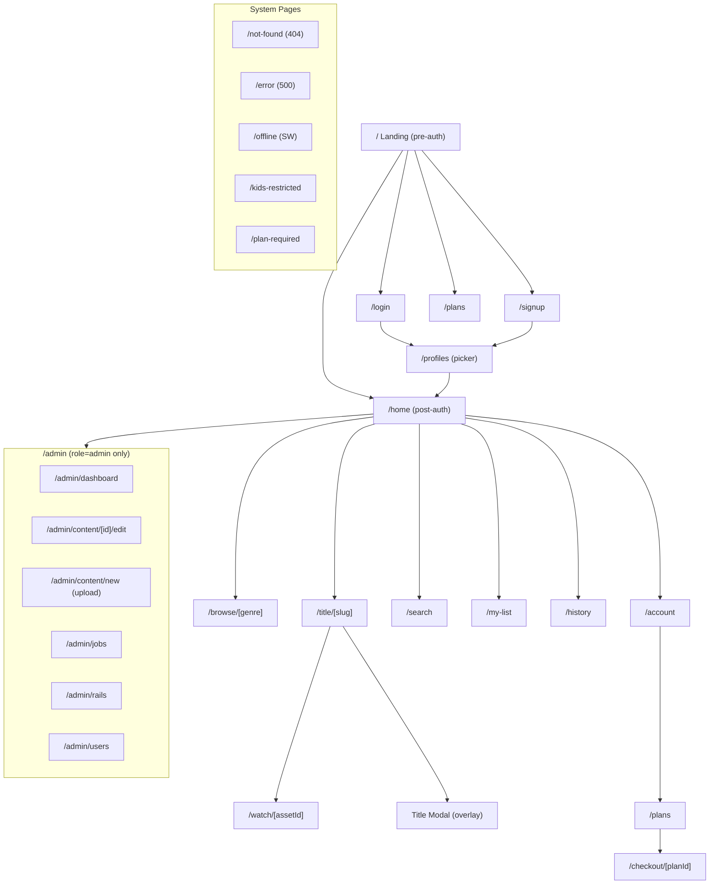
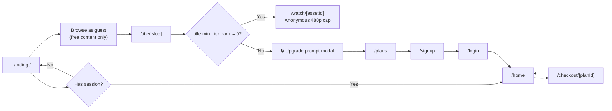
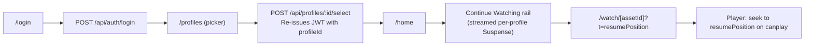
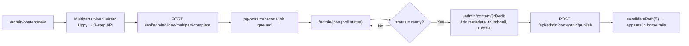

# 08 – UX & Design System

> **Hub document** — all token, component, page, and motion specs live in `docs/design/`.  
> **Stack:** Tailwind CSS v4 · React 19 · Next.js 16 App Router · `motion` (formerly framer-motion)  
> **Theme:** Dark-first (light mode deferred to Phase 2)  
> **A11y target:** WCAG 2.2 AA  
> **Version date:** 2026-09-29

---

## Conflicts Found

| #   | Conflict                                                                                                                                                                                                                                         | Resolution                                                                                                                       |
| --- | ------------------------------------------------------------------------------------------------------------------------------------------------------------------------------------------------------------------------------------------------ | -------------------------------------------------------------------------------------------------------------------------------- |
| C1  | Doc 03 US-303 lists "Auto, 1080p, 720p, 480p, 360p" as fixed quality options; doc 07 skips renditions above source height — not all renditions exist for every asset                                                                             | **Player must query the HLS manifest and show only renditions that actually exist; no hard-coded list in the UI.**               |
| C2  | Doc 07 says segment URLs expire at `duration + 1h`; old doc 08 caching table said ".ts segments: CDN immutable 1 year." These are different layers (signing TTL vs CDN max-age) but the wording was confusing                                    | **Clarified in design/02-player-ux.md: signed-URL TTL ≠ CDN max-age; segment Cache-Control remains `immutable` once delivered.** |
| C3  | Doc 06 search endpoint is `no-store` (session-dependent); page spec initially marked autocomplete as `s-maxage=60`. Autocomplete results depend on `visibilityScope` (plan-based) so cannot be cached at CDN.                                    | **Autocomplete is `no-store` when logged in; anonymous requests may use `s-maxage=30`.**                                         |
| C4  | Kids profile note says `min_age ≤ 7` blocks R/NC-17 content; but the quality cap for anonymous free users (480p) could also affect kids profiles using the Free plan. Both constraints apply independently — no conflict, just under-documented. | **Documented in player-ux and plans page: quality cap + content age gate are orthogonal checks.**                                |

---

## Design Principles

1. **Content-forward** — UI chrome recedes. Content fills the frame. No decorative borders or shadows that compete with artwork.
2. **Cinematic dark** — near-black surfaces, high-contrast text, accent colour pulled from the platform palette (Phase 1) or from dominant artwork colour (Phase 2 ambient theming).
3. **Instant feedback** — every interaction has a visible response within 100 ms (optimistic UI, skeleton states). Nothing appears "stuck".
4. **Progressive disclosure** — rest states are quiet; hover / focus / active states reveal metadata and actions.
5. **Accessible by default** — all interactions keyboard-reachable, WCAG 2.2 AA contrast, visible focus rings, respects `prefers-reduced-motion` and `prefers-contrast`.
6. **Performance as UX** — CLS < 0.1, LCP < 2.5 s, INP < 200 ms. Animations run on the compositor (transform/opacity only). No jank.

---

## Benchmark – Adopt / Adapt / Avoid

| Pattern                    | Netflix        | Prime Video             | Disney+ | Hotstar | YouTube | Our decision                                |
| -------------------------- | -------------- | ----------------------- | ------- | ------- | ------- | ------------------------------------------- |
| Billboard hero autoplay    | Adopt          | Adapt (less aggressive) | Adapt   | Adapt   | N/A     | Adopt: 2 s delay, muted, desktop only       |
| Card hover expansion       | Adopt          | Avoid (busy)            | Adapt   | Avoid   | N/A     | Adopt with sibling dim (no mini-player MVP) |
| Profile picker full-screen | Adopt          | Skip                    | Adopt   | Avoid   | N/A     | Adopt                                       |
| Skip Intro / Skip Recap    | Adapt          | Adopt                   | Adopt   | Adapt   | N/A     | Phase 2                                     |
| Rail scroll (mouse drag)   | Adopt          | Adopt                   | Adopt   | Adopt   | N/A     | Adopt, native scroll-snap                   |
| Bottom nav (mobile)        | Netflix app    | Adapt                   | Adopt   | Adopt   | Adopt   | Adopt                                       |
| Quality selector UX        | Avoid (hidden) | Adopt                   | Adapt   | Adopt   | Adopt   | Adopt: visible, in player menu              |
| Plan comparison table      | Adopt          | Adapt                   | Adapt   | Adopt   | N/A     | Adopt                                       |
| Command palette / search   | Avoid          | Avoid                   | Avoid   | Avoid   | Avoid   | **Add** (cmdk) — differentiator             |
| Ken Burns on billboard     | Avoid          | Avoid                   | Adopt   | Avoid   | N/A     | Phase 2 only, landing page only             |
| Dominant-color ambient bg  | Avoid          | Adopt                   | Adopt   | Avoid   | N/A     | Phase 2 (schema ready)                      |

---

## Information Architecture



---

## Navigation Model

### Desktop (≥ 1200px)

```
┌─────────────────────────────────────────────────────────────┐
│ [Logo] [Home] [Browse ▾] [New]          [🔍] [👤 Profile ▾]│  ← Fixed, 64px, transparent → bg-elevated on scroll
└─────────────────────────────────────────────────────────────┘
Browse dropdown: genre list (8 genres + "All Genres")
Profile dropdown: profile avatars + Switch / Manage / Logout
```

### Tablet (768–1199px)

```
┌──────────────────────────────────────────────────────┐
│ [Logo]   [🔍]  [👤]                                  │  ← Icon-only nav; 56px
└──────────────────────────────────────────────────────┘
Full-screen slide-in drawer for Browse / genre list
```

### Mobile (< 768px)

```
Top bar: Logo + Search icon + Profile icon (48px)

Bottom tab bar (fixed, 56px):
┌────────────────────────────────────────┐
│ [🏠 Home] [🎬 Browse] [🔍 Search] [👤]│
└────────────────────────────────────────┘
```

### TV / 10-Foot (≥ 1920px, pointer: none)

- D-pad navigation via focus management (focus ring always visible, never hidden)
- No hover states; all information visible in rest state
- Larger touch targets (min 56×56px item grid)
- Player controls always visible until 5 s idle timeout
- Phase 2: dedicated TV layout route group `(tv)` with bigger type scale

---

## Sub-Document Map

| File                                                                        | Contents                                                                                           |
| --------------------------------------------------------------------------- | -------------------------------------------------------------------------------------------------- |
| [design-tokens.md](./design/design-tokens.md)                               | OKLCH colors, type scale, spacing, radius, elevation, motion, z-index, Tailwind v4 `@theme static` |
| [visual-language.md](./design/visual-language.md)                           | Art direction, ambient dominant-color theming, typography pairings, grain/gradient/glass rules     |
| [motion-and-interaction.md](./design/motion-and-interaction.md)             | Motion tokens, effect catalog, parallax spec, state machines, Ken Burns specs                      |
| [functional-ui-requirements.md](./design/functional-ui-requirements.md)     | UI functionality checklist (command palette, toasts, PIN flows, admin tools)                       |
| [frontend-stack-and-libraries.md](./design/frontend-stack-and-libraries.md) | Measured client library selections, bundle budgets, dynamic imports                                |
| [implementation-order.md](./design/implementation-order.md)                 | Build order with milestones; static visual prototype first                                         |

---

## User Flow Diagrams

### Flow A – First Visit → Free Watch → Upgrade



### Flow B – Login → Profile Pick → Resume



### Flow C – Admin Upload → Publish



---

## Design Specifications Index & Implementation Order

All specialized design and motion specifications live in `docs/design/`:

- [design-tokens.md](./design/design-tokens.md) — OKLCH dark-first color system, typography scale, spacing, radii, Tailwind v4 `@theme static`.
- [visual-language.md](./design/visual-language.md) — Art direction, ambient dominant-color theming, typography pairings, grain/gradient/glass rules.
- [motion-and-interaction.md](./design/motion-and-interaction.md) — Motion tokens, effect catalog, parallax spec, hover state machine, and Ken Burns specs.
- [functional-ui-requirements.md](./design/functional-ui-requirements.md) — UI capability checklist (Command Palette, shortcuts, toasts, PIN flows, admin tools).
- [frontend-stack-and-libraries.md](./design/frontend-stack-and-libraries.md) — Evaluated client libraries, bundle budgets, and dynamic imports.
- [implementation-order.md](./design/implementation-order.md) — Phased delivery plan anchored by **Milestone 0: Static Visual Prototype**.
- [ADR-0009](../adr/0009-frontend-libraries.md) — Architectural decision record for frontend libraries.

### Milestone 0: Static Visual Prototype

Prior to connecting live database queries or video workers, the team builds a complete **Static Visual Prototype** with mock data:

1. **Landing Page:** Parallax hero, plan comparison cards with cursor glow, FAQs.
2. **Home Page Shell:** Billboard trailer lifecycle, curated rails, content cards with hover expansion (1.08x) and sibling dimming.
3. **Title Quick-View Modal:** Shared-element container transition, metadata pills, cast list.
4. **Profile Picker:** Avatar grid, kids mode toggle with badge.
5. **Video Player Skeleton:** Custom player overlay over Big Buck Bunny HLS stream.

---

## Open Questions

| #   | Status | Question                                                                                                 |
| --- | ------ | -------------------------------------------------------------------------------------------------------- |
| OQ1 | Open   | TV layout route group `(tv)` — separate layout.tsx or CSS-only responsive?                               |
| OQ2 | Open   | Dominant-color extraction: `sharp` in transcode worker (Phase 2) — confirm DB migration plan when ready. |
| OQ3 | Open   | Light mode: design tokens are ready; only a media query override is needed. When to enable?              |
| OQ4 | Open   | Offline support (Service Worker): only error page or partial cache?                                      |

---

## Risks

| Risk                                                   | Impact | Mitigation                                                                                     |
| ------------------------------------------------------ | ------ | ---------------------------------------------------------------------------------------------- |
| Billboard autoplay blocked on mobile by browser policy | Medium | Check `navigator.mediaSession`; fall back to static poster on `canplay` timeout                |
| Rail CLS from Suspense boundaries                      | Medium | Reserve rail height in skeleton (see CLS budget in design/03-accessibility-and-performance.md) |
| Sub-document drift from code                           | Low    | Implementation-order doc gates PRs on doc review                                               |
