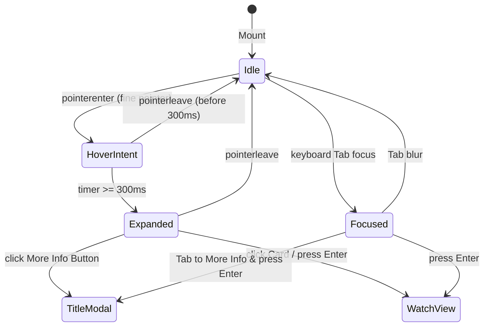
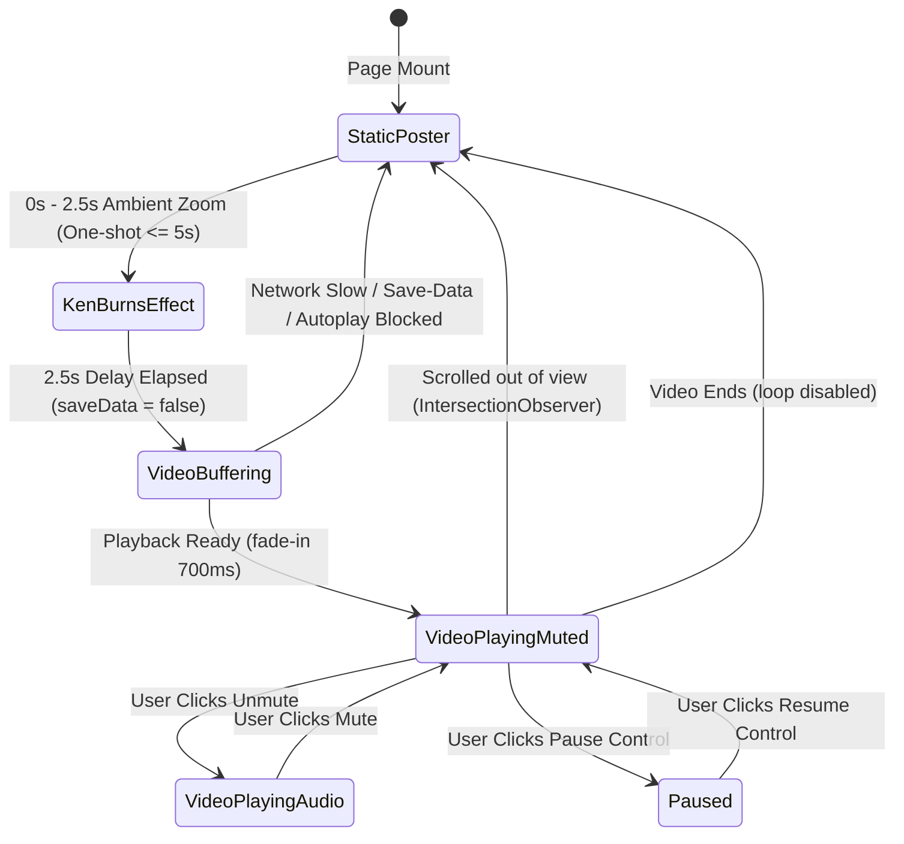
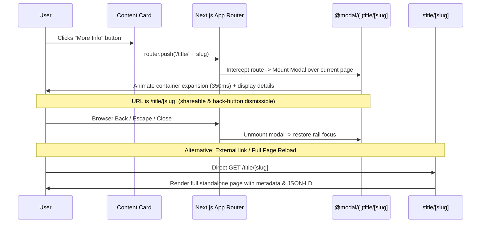

# Motion & Interaction Design Specification

> **Creative Direction & Frontend Engineering Contract**  
> **Source of truth:** [08-ux-and-design-system.md](../08-ux-and-design-system.md) · [design-tokens.md](./design-tokens.md) · [visual-language.md](./visual-language.md)  
> All motion adheres to **WCAG 2.2 Criterion 2.3.3 (Animation from Interactions)** and Core Web Vitals budgets (INP < 200 ms, CLS < 0.1).

---

## 1. Streaming Platform Motion Benchmark

| Platform | Pattern | What We Adopt | What We Adapt | What We Avoid |
|----------|---------|---------------|---------------|---------------|
| **Netflix** | Card hover expansion (scale 1.25x with sound/preview) | Card pop-out scale on fine pointer with delay | Use gentle scale (1.08x) without audio; preserve row height | Avoid aggressive 1.3x expansion that causes sibling clipping and layout jitter |
| **Apple TV+** | Ambient glow, subtle depth, smooth deceleration | Sophisticated fluid easings (`cubic-bezier(0.16, 1, 0.3, 1)`) and soft specular highlights | Constrain glow to compositor-driven `opacity` on pre-rendered gradient layers | Avoid heavy non-accelerated drop-shadow blurs that drop FPS below 60 |
| **Prime Video** | Super-condensed rails, immediate card details banner | Quick-view detail presentation | Next.js Intercepting Route modal (`@modal/(.)title/[slug]`) instead of in-flow rail push | Avoid abrupt layout shifts when preview rows insert between rails |
| **Disney+** | 3D brand tiles, subtle hover tilt | Subtle 2.5D perspective tilt on hero banner cards | Limit tilt to ±3 degrees via CSS transform on desktop only | Avoid heavy 3D WebGL scenes that consume battery and elevate INP |
| **Hotstar** | Tabbed sports/genre navigation, sticky controls | Responsive tab transitions and swipeable touch carousels | Native CSS scroll-snap with momentum touch scrolling | Avoid custom JS scroll-jacking that breaks browser back-forward cache |

---

## 2. Motion Tokens

> **Canonical Definition:** All motion tokens (`--duration-*`, `--ease-*`, `--stagger-*`) are defined in [design-tokens.md](./design-tokens.md). No motion tokens are redefined here.

---

## 3. Interaction & Motion Rules

### Rule 1: Strictly Transform & Opacity Only (Compositor Acceleration)
- **Zero Paint / Reflow Budget:** Every visual transition **must mutate only `transform` and `opacity`**.
- Animating `width`, `height`, `top`, `left`, `margin`, `padding`, or `filter` is **strictly forbidden**.
- **Crossfade Overlays for Background / Scrim Transitions:**
  Instead of animating `background-color` or `backdrop-filter`, components render an absolute overlay layer whose `opacity` transitions between `0` and `1`:
  ```tsx
  {/* Navbar Scrim: Hardware-accelerated opacity transition */}
  <header className="fixed top-0 inset-x-0 h-16 z-navbar">
    <div className={`absolute inset-0 bg-bg-base/80 backdrop-blur-md border-b border-border transition-opacity duration-fast ${isScrolled ? 'opacity-100' : 'opacity-0'}`} />
    <nav className="relative z-10 flex items-center h-full px-page-gutter">...</nav>
  </header>
  ```

### Rule 2: Semantic Links & Explicit Actions (No Space/Enter Split)
- **Card Navigation:** The content card is a semantic `<Link href={`/watch/${assetId}`}>` anchor. Clicking or pressing `Enter` directly launches playback.
- **Title Quick-View Button:** A separate, visible button (`<button aria-label="More info" onClick={openQuickView}>`) is rendered on the card overlay.
- This eliminates ambiguous keyboard shortcuts (like splitting Space and Enter on a single element) and ensures full accessibility across screen readers and keyboard users.

### Rule 3: Quick-View as an Intercepting Route with URL Sync
- **Client Route Interception:** Triggering "More info" navigates to `/title/[slug]` intercepted via Next.js parallel route `@modal/(.)title/[slug]/page.tsx`.
- **URL & History:** The browser URL updates to `/title/[slug]`. Users can share the URL, reload the page, or press Back to dismiss the modal.
- **Direct Hit / Full Page:** If a user loads `/title/[slug]` directly or opens it in a new tab, the complete standalone page (`src/app/(public)/title/[slug]/page.tsx`) renders with full SEO metadata and JSON-LD structured data.

### Rule 4: Strict Hover Guard & Mobile Touch
- Hover states exist **only** within `@media (hover: hover) and (pointer: fine)`.
- Touch devices tap directly to navigate or tap the "More Info" button to open the mobile drawer (Vaul).

---

## 4. Effect Catalog

| Effect | Where Used | Trigger | Properties Animated | Duration / Easing | Reduced Motion Fallback | Touch Fallback | Milestone |
|--------|------------|---------|---------------------|-------------------|------------------------|----------------|-----------|
| **Card Hover Expansion** | Content Rails, Browse Grids | Pointer hover > 300ms delay | `transform: scale(1.08) translateZ(0)` | 220ms `--ease-entrance` | Instant border highlight (`--color-border-focus`) | Scale disabled; tap navigates | `[MVP]` |
| **Sibling Dimming** | Content Rails | Card hover active | `opacity: 0.45` | 220ms `--ease-standard` | None (all cards stay opacity: 1) | Deactivated | `[MVP]` |
| **Rail Scroll & Snap** | Home Page, Browse Rails | Prev/Next arrow click, touch flick | `scroll-left` via CSS scroll-snap | Browser native momentum / 400ms smooth | Instant jump scroll | Native momentum touch flick | `[MVP]` |
| **Navbar Scrim Crossfade** | Root Layout Nav | Window scroll `y > 40px` | `opacity: 0 -> 1` on pre-rendered backdrop overlay | 150ms `--ease-standard` | Instant opacity swap (0ms) | Same | `[MVP]` |
| **Billboard Trailer Transition** | Home Hero Billboard | 2.5s idle after page load | `opacity: 0 -> 1` (video fades in over poster) | 700ms `--ease-cinematic` | Video does not autoplay; poster remains | Static poster only | `[MVP]` |
| **Billboard Ken Burns** | Home Billboard (static state) | Ambient on load | `transform: scale(1.0) -> scale(1.04)` | **One-shot 5s** `--ease-cinematic` (or pausable) | Static `scale(1.0)` | Static `scale(1.0)` | `[MVP]` |
| **Button Press Micro-Interaction** | All primary / secondary buttons | `:active`, keyboard Enter down | `transform: scale(0.97)` | 75ms `--ease-standard` | Color shift only (`--color-surface-hover`) | Touch `:active` scale 0.97 | `[MVP]` |
| **My List Checkmark Flip** | Card quick-actions, Detail Hero | Click / Enter | `transform: rotateY(180deg) scale(1.15)` | 220ms `--ease-spring` | Instant icon swap (`+` → `✓`) | Instant icon swap | `[MVP]` |
| **Rating Thumbs Pop** | Title detail, modal | Click / Enter | `transform: scale(1.25) -> scale(1.0)` | 220ms `--ease-spring` | Color fill swap only | Instant color fill | `[MVP]` |
| **Scrubber Bar Expansion** | Video Player Controls | Mouse hover over scrubber | `transform: scaleY(2.0)` (from 4px to 8px height) | 150ms `--ease-standard` | Instant scaleY(2.0) | Always 8px height for touch tap target | `[MVP]` |
| **Next-Episode Card Countdown** | End of Episode Player Overlay | Triggered when `remainingSeconds <= 15` | `stroke-dashoffset` on SVG circular timer | 10s `linear` | Numeric text countdown "Playing in 10s" | Touch tap "Play Now" button | `[MVP]` |
| **Plan Card Cursor Glow** | Plans / Pricing Page | Pointer movement over card | `opacity` on radial gradient layer | 75ms compositor | Static subtle border accent | Static subtle border accent | `[MVP]` |
| **Card to Modal Transition** | Rail Card → Quick-View Dialog | Click "More info" | Container bounds transform (FLIP / `layoutId`) | 350ms `--ease-entrance` | Fade-in dialog (`opacity: 0 -> 1`) | Bottom sheet slide-up | `[MVP]` |
| **Skeleton Shimmer** | Loading States (Rails, Billboard) | Data loading | `transform: translateX(-100% -> 100%)` | 1.6s `linear` infinite | Pulsing opacity `0.4 <-> 0.8` | Same pulsing opacity | `[MVP]` |
| **Blur-Up Image Crossfade** | Content Cards, Posters | Image decode complete | `opacity: 0 -> 1` over blur placeholder | 220ms `--ease-standard` | Instant replace upon load | Instant replace upon load | `[MVP]` |
| **In-Card Trailer Preview** | Content Card on prolonged hover | Hover > 800ms | Video layer `opacity: 0 -> 1` | 300ms `--ease-standard` | Disabled | Disabled | `[P2]` |

---

## 5. Parallax Specification

Parallax is strictly confined to top-level presentation heroes. **It is forbidden on content rails, cards, players, checkouts, and admin views.**

### Implementation Standard
- Use **native CSS Scroll-Driven Animations** with zero JavaScript scroll listeners:
  ```css
  @supports (animation-timeline: scroll()) {
    .parallax-hero-backdrop {
      animation: hero-parallax linear both;
      animation-timeline: scroll(root);
      animation-range: 0px 500px;
    }
  }
  @keyframes hero-parallax {
    to { transform: translateY(100px) scale(1.05); }
  }
  ```
- **Fallback:** Framer Motion `useScroll()` with `useTransform()` when scroll timelines are unsupported.
- **Scroll Hijacking Ban:** Overriding native mouse wheel physics or scroll momentum is strictly prohibited.

---

## 6. Interaction State Machines (Mermaid Diagrams)

### 6.1 Card Hover State Machine



### 6.2 Billboard Trailer Lifecycle (with Visible Pause Control)



### 6.3 Intercepting Route Card-to-Modal Transition



---

## 7. Open Questions

| # | Question | Owner | Recommendation | Status |
|---|----------|-------|----------------|--------|
| OQ-M01 | In-card video trailer previews | Product | Deferred to **Phase 2** (`[P2]`). Phase 1 displays high-resolution backdrop art and metadata cards on hover. | ✅ Closed (P2) |
| OQ-M02 | Sibling dimming scope | Design | Dims non-hovered siblings in the immediate active rail to `0.45` opacity. | ✅ Closed |

---

## 8. Risks & Mitigations

| Risk | Impact | Mitigation |
|------|--------|-----------|
| **Compositor Overflow** | Frame drops (< 60 FPS) during rapid scrolling | Dynamic `will-change: transform` applied strictly during hover; removed on exit. |
| **Mobile Layout Shift** | Touch taps expanding cards inadvertently | Hover expansion restricted via `@media (hover: hover) and (pointer: fine)`. |
| **Notification Accessibility** | Toast alerts not heard by screen readers | Sonner renders ARIA live region (`aria-live="polite"`, `role="status"`). No non-standard keyboard shortcuts (`F6`). |
