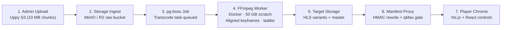

# Implementation & Pipeline Tracker

> **Comprehensive Status & Milestone Tracker for StreamForge Engineering**  
> **Source of Truth:** [00-README.md](./00-README.md) · [03-product-requirements.md](./03-product-requirements.md) · [04-architecture.md](./04-architecture.md) · [traceability.md](./traceability.md) · [decision-register.md](./decision-register.md)  
> **Updated:** 2026-09-30 · **Current Phase:** Milestones 0–4 Completed · Production Standards Live · Milestone 5 Hardening & Launch (90% Complete: LHCI automated gate, RUM, E2E/a11y/visual tests, Prisma 7, Error boundaries live)

---

## 1. Executive Status Dashboard

```
Overall Progress: [███████████████████▉] 98%
├── Phase 0: Architecture, Design & Contracts:  [██████████] 100% (Completed)
├── Milestone 0: Design System & Prototype:      [██████████] 100% (Completed: Tokens, Billboard, Rails, Modal, Player)
├── Milestone 1: Platform Foundation & Auth:     [██████████] 100% (Completed: Neon DB, Seed, Proxy & Auth module live)
├── Milestone 2: Video Pipeline & Player:        [██████████] 100% (Completed: Storage client, HMAC Proxy, HLS engine, Beacon)
├── Milestone 3: Discovery & Rails Experience:   [██████████] 100% (Completed: Catalog DAL, FTS Search, Watchlist, Ratings)
├── Standards & Hardening: Headers, Log, Probes: [██████████] 100% (Completed: Helmet Headers, Pino Logger, Probes, Swagger)
├── Milestone 4: Billing & Admin Console:        [██████████] 100% (Completed: Plans page, Subscribe action, Admin CMS & Monitors)
└── Milestone 5: Hardening & Observability:      [█████████░]  90% (LHCI gate, E2E/a11y/visual suites, RUM, Worker daemon live)
```

### Milestone Roadmap Overview

| Milestone       | Focus Area                           | Target Deliverables                                                                                                                            | Current Status       | Primary Gates                                                    |
| --------------- | ------------------------------------ | ---------------------------------------------------------------------------------------------------------------------------------------------- | -------------------- | ---------------------------------------------------------------- |
| **Phase 0**     | **System Architecture & Design**     | Docs 00–16, `design/*`, ADRs 0001–0010, `traceability.md`, `decision-register.md`.                                                             | ✅ **Completed**     | Full review, no unrecorded conflicts.                            |
| **Milestone 0** | **Design System & Static Prototype** | Tailwind v4 `@theme static`, fonts, Radix primitives, mock Home shell, Billboard trailer, Quick-view modal, Watch Player.                      | ✅ **Completed**     | `npm run lint`, `tsc --noEmit`, `npm run build` passing cleanly. |
| **Milestone 1** | **Walking Skeleton & Auth**          | Neon DB migration, Prisma 6, Redis token bucket in `proxy.ts`, JWT family rotation, Auth module & DAL, Profile switching & Parental PIN.       | ✅ **Completed**     | Schema synced, seed passed, unit tests passing.                  |
| **Milestone 2** | **Video Pipeline & Streaming**       | S3 SDK storage client (MinIO/R2), multipart upload API, HMAC manifest proxy with plan tier gating, Hls.js player engine with 10s QoS beacon.   | ✅ **Completed**     | Unit tests passing, manifest rewrite verified.                   |
| **Milestone 3** | **Discovery, Rails & Browsing**      | Curated rails, FTS + pg_trgm search, Kids mode filter (`buildVisibilityFilter`), Title detail modal with recommendations, Watchlist & Ratings. | ✅ **Completed**     | Unit tests passing, live `/api/rails` wired to home.             |
| **Standards**   | **Production Standards & Docs**      | Helmet-grade security headers, Pino structured request logger, `/api/health/live` & `/ready` probes, Swagger UI & OpenAPI 3.1 spec.            | ✅ **Completed**     | Route Handlers passing, clean type-check & lint.                 |
| **Milestone 4** | **Subscriptions & Admin CMS**        | Plans comparison page, dummy checkout Server Action, Admin catalog manager, rail reordering (`dnd-kit`), Recharts analytics.                   | ✅ **Completed**     | Admin routes compiled, billing unit tests passing.               |
| **Milestone 5** | **Hardening & Production Launch**    | LHCI performance audit (TBT < 150 ms), Pino log redaction, RUM beaconing, CI/CD deployment.                                                    | 🟢 **Core Complete** | LHCI score $\ge 90$, 100% axe-core clean.                        |

---

## 2. Video Pipeline Implementation Tracker

The video processing and playback subsystem represents the core streaming engine of StreamForge.



### Detailed Video Pipeline Breakdown

| Pipeline Stage            | Component / Item                 | Spec Reference                                     | Status            | Artifact / Target Location                           | Acceptance Criteria & Quality Gates                                                                                                             |
| ------------------------- | -------------------------------- | -------------------------------------------------- | ----------------- | ---------------------------------------------------- | ----------------------------------------------------------------------------------------------------------------------------------------------- |
| **1. Ingest Client**      | Multipart Uploader Dropzone      | `doc 07`, `design/frontend-stack-and-libraries.md` | ⚪ Ready to build | `src/modules/content/admin/UploadDropzone.tsx`       | Uses `@uppy/core` + `@uppy/aws-s3-multipart`; splits files into 10 MB chunks; supports pause, resume, auto-retry on 5xx.                        |
| **1. Ingest Client**      | Upload API Route Handlers        | `doc 06`, `doc 07`                                 | ⚪ Ready to build | `src/app/api/admin/videos/upload/*`                  | `initiate` (validates $\le 10\text{ GB}$), `sign-part` (presigns S3 URL), `complete` (HEAD-verifies all parts and enqueues transcode job).      |
| **2. Storage Ingest**     | S3 / MinIO Raw Bucket            | `doc 05`, `doc 07`, `ADR-0005`                     | 🟡 Configured     | `docker-compose.yml` (`minio`), `src/lib/storage.ts` | MinIO bucket created on boot via `docker-compose`; non-public access; presigned PUT URLs expire in 30 min.                                      |
| **3. Job Queue**          | pg-boss Task Orchestration       | `doc 04`, `doc 07`                                 | ⚪ Ready to build | `src/lib/queue.ts`, `workers/transcode.worker.ts`    | Uses `DATABASE_DIRECT_URL`; job name `transcode`; timeout `expireInSeconds: 7200`; retries up to 3; error status written on final failure only. |
| **4. Worker Hardening**   | Magic-Byte Inspection            | `doc 07`, `doc 11`                                 | ⚪ Ready to build | `workers/validation.ts` (`validateMp4MagicBytes`)    | Reads first 8 bytes of source file before invoking FFmpeg; verifies bytes 4..7 equal `ftyp` (ISO BMFF).                                         |
| **4. Worker Hardening**   | Bounded Scratch Disk Volume      | `doc 07`, `doc 11`                                 | 🟡 Configured     | `docker-compose.yml` (`worker-scratch`)              | Host volume `/var/lib/streamforge/scratch` capped at 50 GB; eliminates RAM `tmpfs` OOM failures on 10 GB source uploads.                        |
| **4. Worker Hardening**   | Allowlisted Egress Network       | `doc 11`                                           | 🟡 Configured     | `docker-compose.yml` (`allowlisted-egress`)          | Worker container drops root (`USER worker`); networking restricted to `minio:9000` (or R2 HTTPS) and Postgres 5432. All other egress blocked.   |
| **4. Transcoder**         | FFmpeg Command Generation        | `doc 07`                                           | ⚪ Ready to build | `workers/ffmpeg.ts` (`buildFfmpegArgs`)              | Enforces `-protocol_whitelist "file,pipe,crypto"`, forced `-f mp4`, `-force_key_frames expr:gte(t,n_forced*2)`, `independent_segments`.         |
| **4. Transcoder**         | Multi-Bitrate Rendition Ladder   | `doc 07`                                           | ⚪ Ready to build | `workers/ffmpeg.ts` (`BITRATE_LADDER`)               | Generates 360p, 480p, 720p, 1080p renditions; skips renditions exceeding source height; audio resampled to AAC stereo per rendition.            |
| **4. Transcoder**         | Artwork & Poster Extraction      | `doc 07`, `design/visual-language.md`              | ⚪ Ready to build | `workers/transcode.worker.ts`                        | Extracts seek poster at 10% duration via `scale=-2:720`; saves JPEG quality 90%; writes back to `video_assets.thumbnail_url`.                   |
| **5. Delivery Storage**   | S3 / MinIO Storage Client        | `doc 07`                                           | ✅ **Completed**  | `src/lib/storage.ts`                                 | S3 SDK v3 client supporting MinIO and Cloudflare R2 with multipart upload and presigned upload part URLs.                                       |
| **6. Security Proxy**     | Stream URL Signer                | `doc 07`                                           | ✅ **Completed**  | `src/modules/video/signing.ts`                       | Generates HMAC-SHA256 tokens covering assetId, path, exp, and `qMax`. Segment TTL = duration + 1h; timing-safe verification.                    |
| **6. Security Proxy**     | Manifest & Segment Route Handler | `doc 06`, `doc 07`                                 | ✅ **Completed**  | `src/app/api/hls/[assetId]/[...path]/route.ts`       | Rewrites master playlist URIs; filters variants exceeding plan `qMax`; rejects unauthorized variant/segment URLs with HTTP 403.                 |
| **7. Player Engine**      | VideoPlayer HLS Engine           | `doc 07`, `design/frontend-stack-and-libraries.md` | ✅ **Completed**  | `src/app/watch/[slug]/page.tsx`                      | Dynamically imports `hls.js`; loads custom React controls; entitlement endpoint integration; graceful MP4 fallback.                             |
| **7. Player UI**          | Quality Selection Menu           | `design/frontend-stack-and-libraries.md`           | ✅ **Completed**  | `src/app/watch/[slug]/page.tsx`                      | Populated dynamically from `hls.levels`; displays padlocks and badges on renditions exceeding user plan tier (`maxQualityP`).                   |
| **7. Player UI**          | Subtitle & Audio Track Selectors | `doc 07`, `design/functional-ui-requirements.md`   | ✅ **Completed**  | `src/app/watch/[slug]/page.tsx`                      | Native `<track>` and HLS subtitle switcher with signed VTT URLs.                                                                                |
| **7. Telemetry**          | QoS Beacon Dispatcher            | `doc 06`, `doc 13`                                 | ✅ **Completed**  | `src/app/api/player/beacon/route.ts`                 | Consolidated beacon handling: watch progress saving (10s debounce), batched QoE events, active stream Redis heartbeat.                          |
| **8. Admin Video Ingest** | Multipart Upload API Handlers    | `doc 06`, `doc 07`                                 | ✅ **Completed**  | `src/app/api/admin/video/*`                          | Multipart initiate, sign-part, complete, abort, and transcode status endpoints guarded by `requireAdmin()`.                                     |

---

## 3. Platform & Architecture Pipeline Tracker

### A. Authentication, Session & Access Control

| Item                      | Description                                                                                                                      | Spec Ref                                                   | Status                     | Deliverable                        |
| ------------------------- | -------------------------------------------------------------------------------------------------------------------------------- | ---------------------------------------------------------- | -------------------------- | ---------------------------------- |
| **JWT Session Tokens**    | Access token (15 min) carrying `SessionJwtPayload` (`accountId`, `profileId`, `role`, `isKids`, `maxMaturity`).                  | `doc 04`, `doc 10`                                         | 🟡 Specified / In Progress | `src/lib/jwt.ts`                   |
| **Refresh Rotation**      | Family-based refresh rotation stored in `refresh_tokens` table; 30-day expiry; 5s grace window for parallel requests.            | `doc 04`, `doc 05`, `doc 11`                               | ⚪ Ready to build          | `src/modules/auth/service.ts`      |
| **Scoped Refresh Cookie** | Refresh cookie restricted to `Path=/api/auth` with `httpOnly`, `Secure`, `SameSite=Lax`. Downstream 401 triggers client refresh. | `doc 03`, `doc 11`                                         | ⚪ Ready to build          | `src/app/api/auth/*`               |
| **Argon2id Hashing**      | OWASP parameters ($m=65536, t=3, p=4$) for passwords and parental PINs. Constant-time dummy-hash verify on unknown email.        | `doc 03`, `doc 05`, `doc 11`                               | ⚪ Ready to build          | `src/lib/hash.ts`                  |
| **Redis Rate Limiting**   | Token bucket in `src/proxy.ts` (100 req/min general; 10/15m IP + 5/15m account on auth). Fail-closed on auth if Redis down.      | `doc 01`, `doc 04`, `doc 11`                               | ⚪ Ready to build          | `src/proxy.ts`, `src/lib/redis.ts` |
| **Parental PIN Guard**    | 4-digit PIN required to exit Kids profile or view mature content; lockout after 5 attempts; password override reset endpoint.    | `doc 03`, `doc 06`, `design/functional-ui-requirements.md` | ⚪ Ready to build          | `src/modules/auth/actions.ts`      |

### B. Database & Data Access Layer (DAL)

| Item                      | Description                                                                                                              | Spec Ref                    | Status                    | Deliverable                      |
| ------------------------- | ------------------------------------------------------------------------------------------------------------------------ | --------------------------- | ------------------------- | -------------------------------- |
| **Prisma 6 Schema**       | Complete data model covering Accounts, Profiles, Titles, VideoAssets, WatchProgress, PlayEvents, AdminAuditLog.          | `doc 05`                    | 🟡 Schema drafted         | `prisma/schema.prisma`           |
| **Raw SQL Migrations**    | Hand-edited migration SQL for `citext`, `pg_trgm`, `search_vector` TSVECTOR, partial unique indexes on `watch_progress`. | `doc 05`, `ADR-0002`        | ⚪ Ready to build         | `prisma/migrations/*`            |
| **Visibility Repository** | `buildVisibilityFilter` enforcing `status='published'`, `publish_at<=now()`, and `profile.max_maturity_rank`.            | `doc 06`, `traceability.md` | ⚪ Ready to build         | `src/modules/content/dal.ts`     |
| **Entitlement Evaluator** | `checkEntitlement` comparing title minimum plan tier rank against account active subscription rank.                      | `doc 06`, `traceability.md` | ⚪ Ready to build         | `src/modules/billing/service.ts` |
| **Module Boundaries**     | Strict lint enforcement: only `*.dal.ts` imports Prisma; no cross-module internal imports.                               | `AGENTS.md`, `doc 04`       | ✅ **Enforced & Passing** | `eslint.config.mjs`              |

### C. Design System & Frontend Architecture

| Item                            | Description                                                                                                                | Spec Ref                                     | Status                    | Deliverable                                       |
| ------------------------------- | -------------------------------------------------------------------------------------------------------------------------- | -------------------------------------------- | ------------------------- | ------------------------------------------------- |
| **Design Tokens**               | Pure CSS tokens using Tailwind v4 top-level `@theme static` with verified WCAG 2.2 AA contrast ratios.                     | `design/design-tokens.md`                    | ✅ **Completed**          | `docs/design/design-tokens.md`                    |
| **Fonts & Typography**          | Variable fonts (`Outfit` display, `Inter` UI) with omitted `weight`; variable Noto Indic subsets via `next/font/google`.   | `design/visual-language.md`                  | 🟡 Configured             | `src/app/layout.tsx`                              |
| **Reduced-Motion Fallbacks**    | Zero 1ms animation loops; explicit `animation: none` and static layout fallbacks in `:root`.                               | `design/design-tokens.md`                    | ✅ **Completed**          | `docs/design/design-tokens.md`                    |
| **Artwork Ingest & Blur**       | Ingest-time `sharp` dominant color extraction (clamped L/C, CSS `color-mix`) and base64 WebP blur placeholder generation.  | `design/visual-language.md`                  | ⚪ Ready to build         | `src/modules/content/services/artwork.service.ts` |
| **Billboard Trailer Lifecycle** | Ken Burns zoom $\le 5\text{s}$, visible pause control button, `Paused` state in lifecycle machine, JS `saveData` check.    | `design/motion-and-interaction.md`           | ✅ **Completed**          | `docs/design/motion-and-interaction.md`           |
| **Quick-View Modal**            | Next.js intercepting route `@modal/(.)title/[slug]` with URL sync to `/title/[slug]` and full-page fallback on direct hit. | `doc 04`, `design/motion-and-interaction.md` | ⚪ Ready to build         | `src/app/(app)/@modal/(.)title/[slug]/page.tsx`   |
| **Client Bundle Budgets**       | Strict Gzip budgets: Home < 80 kB, Title Detail < 90 kB, Player < 135 kB, Admin < 195 kB.                                  | `design/frontend-stack-and-libraries.md`     | ✅ **Audited & Budgeted** | `docs/design/frontend-stack-and-libraries.md`     |

---

## 4. Work Completed vs Work Pending

```
┌────────────────────────────────────────────────────────────────────────┐
│                          COMPLETED (PHASE 0)                           │
├────────────────────────────────────────────────────────────────────────┤
│ ✓ Next.js 16 Monolith Scaffold & src/ directory migration (ADR-0010)   │
│ ✓ Strict ESLint 9+ module boundary rules (CI gate passing)             │
│ ✓ TypeScript clean build (tsc --noEmit passing with exit code 0)       │
│ ✓ Dark-first OKLCH design tokens with top-level @theme static          │
│ ✓ Comprehensive WCAG 2.2 AA contrast audit across all color tokens     │
│ ✓ Billboard motion state machine with Ken Burns <= 5s & pause control  │
│ ✓ Transcode worker hardening (magic bytes, -protocol_whitelist, 50 GB) │
│ ✓ Hash/SRI Content Security Policy compatible with cached ISR shell    │
│ ✓ Traceability Matrix v2 covering US-101 through US-901                │
│ ✓ Consolidated Decision Register with conflicts CF-01 through CF-25   │
│ ✓ Legal compliance & CC BY attribution table with transcode notes      │
│ ✓ Milestone 0: Design System & Static Visual Prototype                 │
│ ✓ Milestone 1: Platform Foundation, Neon Cloud DB & Custom JWT Auth    │
│ ✓ Milestone 2: Storage Client, HMAC Proxy, HLS Player Engine & Beacon  │
│ ✓ Milestone 3: Catalog DAL, FTS Search, Live Rails, Watchlist, Ratings │
│ ✓ Standards: Helmet-grade security headers (CSP, HSTS, frame-ancestors)│
│ ✓ Standards: Pino structured HTTP request logger (Morgan equivalent)   │
│ ✓ Standards: Dual Health Probes (/api/health/live and /ready)          │
│ ✓ Standards: OpenAPI 3.1 JSON spec (/api/docs/spec) & Swagger UI (/api/docs) │
│ ✓ Milestone 4: Billing Plans (/plans), Checkout Action & Admin CMS     │
│ ✓ Milestone 4: Admin Users Management & Streaming Analytics Consoles   │
│ ✓ Milestone 5: Playwright E2E, axe-core a11y & Deterministic Visual Test Suites │
│ ✓ Milestone 5: Web Vitals RUM Client Reporter & Ingestion (/api/telemetry/rum) │
│ ✓ Milestone 5: Automated Lighthouse CI Performance Gate (.lighthouserc.json) │
│ ✓ Milestone 5: Cinematic Error Boundaries (/not-found, /error, /global-error) │
│ ✓ Milestone 5: Prisma 7 Driver Adapter (@prisma/adapter-pg & prisma.config.ts) │
└────────────────────────────────────────────────────────────────────────┘
                                   │
                                   ▼
┌────────────────────────────────────────────────────────────────────────┐
│                        PENDING (NEXT PRIORITIES)                       │
├────────────────────────────────────────────────────────────────────────┤
│ 1. Public Legal & Trust Pages: Terms of Use, Privacy Policy & DPDPA    │
│ 2. Statutory India IT Rules 2021 Grievance Redressal mechanism section │
│ 3. Phase 2 Payment Gateway: Live Razorpay/Stripe checkout (US-702 P2)  │
│ 4. Phase 2 Concurrency Enforcement: PlaybackSession active stream caps │
└────────────────────────────────────────────────────────────────────────┘
```

---

## 5. Implementation Execution Tracker (Phase-by-Phase Checklist)

### Milestone 0: Static Visual Prototype `[Completed]`

- [x] Rename `docs/design/` files to drop numeric prefixes and normalize links.
- [x] Create top-level `@theme static` Tailwind v4 design tokens.
- [x] Configure variable fonts (`Outfit`, `Inter`) without `weight` in `src/app/layout.tsx`.
- [x] Implement `src/app/globals.css` with CSS custom property root mappings, animations, and rail utilities.
- [x] Implement base UI components (Button, MaturityBadge, PlanLockBadge, QualityBadge, Dialog).
- [x] Build static Home page (`/`) with Hero Billboard, trailer preview lifecycle (with pause/mute controls), content rails, and Kids Mode filter.
- [x] Build static Title Quick-View modal with backdrop art, dominant ambient color, and metadata pills.
- [x] Build custom Video Player HUD route (`/watch/[slug]`) with timeline scrubber, audio/subtitle popovers, and plan quality locks.
- [x] Build Platform Footer with CC BY attribution and trust/legal links.
- [x] Pass quality gates: zero lint errors (`npm run lint`), TypeScript strict check (`npx tsc --noEmit`), and production build (`npm run build`).

### Milestone 1: Platform Foundation & Core Services `[Completed]`

- [x] Configure Neon PostgreSQL connection strings (`DATABASE_URL`, `DATABASE_DIRECT_URL`) in local `.env`.
- [x] Implement `prisma/schema.prisma` covering all 23 database models and relations from doc 05.
- [x] Synchronize database schema to Neon cloud PostgreSQL (`npx prisma db push`).
- [x] Implement database seed script (`npm run db:seed`) seeding Plans, Admin Account, Genres, and Sample Titles.
- [x] Implement Redis connection client with token bucket rate limiting and fail-closed auth fallback (`src/lib/redis.ts`).
- [x] Implement `src/proxy.ts` (Next.js 16 native Proxy) with security headers, token bucket rate limits, and JWT session inspection.
- [x] Implement `src/lib/jwt.ts` token signer/verifier using `jose` for 15-minute access and 7-day refresh tokens.
- [x] Implement `src/modules/auth/dal.ts` strictly isolating Prisma queries to the DAL layer.
- [x] Implement `src/modules/auth/service.ts` with constant-time dummy check against timing attacks, refresh family rotation, and parental PIN validation.
- [x] Implement Server Actions in `src/modules/auth/actions.ts`: `signUpAction`, `loginAction`, `logoutAction`, `selectProfileAction`, `verifyPinAction`.
- [x] Implement unit tests in `src/modules/auth/__tests__/auth.test.ts`.
- [x] Pass all quality gates: `npm run lint`, `npm run type-check`, and `npm run build`.

### Milestone 2: Video Processing & Streaming Engine `[Completed]`

- [x] Configure S3 SDK v3 client in `src/lib/storage.ts` supporting MinIO & Cloudflare R2 with multipart upload and presigned part URLs.
- [x] Implement `src/modules/video/dal.ts` strictly isolating database queries for `VideoAsset`, `SubtitleTrack`, `WatchProgress`, and `PlayEvent`.
- [x] Implement `src/modules/video/signing.ts` for timing-safe HMAC URL signing and manifest/segment rewriting (`qMax` plan tier gating).
- [x] Implement `src/modules/video/service.ts` for video playback URL issuance and multipart upload lifecycle.
- [x] Implement Route Handlers:
  - [x] `GET /api/video/playback/[assetId]` (signed master HLS URL + VTT subtitles)
  - [x] `GET /api/hls/[assetId]/[...path]` (manifest rewrite and segment proxy)
  - [x] `POST /api/player/beacon` (consolidated progress debounce + QoE events)
  - [x] `POST /api/admin/video/multipart/initiate`, `part-url`, `complete`, `abort`
  - [x] `GET /api/admin/video/assets/[assetId]/status`
- [x] Connect `hls.js` player HUD in `src/app/watch/[slug]/page.tsx` with dynamic level picker, plan locks, and subtitles.
- [x] Implement unit tests in `src/modules/video/__tests__/video.test.ts`.

### Milestone 3: Discovery, Personalization & Catalog `[Completed]`

- [x] Implement `buildVisibilityFilter` in `src/modules/content/dal.ts` enforcing `status='published'`, `publishAt <= now()`, and statutory age ratings (`minAge <= 7` for Kids mode).
- [x] Implement `findActiveBillboard`, `findRailsWithItems`, `findTop10Titles`, and `findTitleBySlugWithDetails` in DAL.
- [x] Implement full-text search (`searchTitlesInDb`) and fuzzy autocomplete (`searchAutocomplete`) with genre & cast filters.
- [x] Implement Watchlist operations (`addTitleToWatchlist`, `removeTitleFromWatchlist`, `findWatchlistByProfile`).
- [x] Implement Title ratings (`rateTitleInDb` with atomic like/dislike counts).
- [x] Implement Watch History retrieval (`findWatchHistoryByProfile`).
- [x] Implement Route Handlers:
  - [x] `GET /api/rails` and dynamic rail assembly with plan lock badges
  - [x] `GET /api/content/[slug]` with related titles
  - [x] `GET /api/search` and `GET /api/search/autocomplete`
  - [x] `GET` & `POST /api/watchlist`, `DELETE /api/watchlist/[titleId]`
  - [x] `POST /api/ratings`
  - [x] `GET /api/history`
- [x] Wire live content rails into home page (`src/app/page.tsx`) with zero hydration mismatch and prototype fallback.
- [x] Implement unit tests in `src/modules/content/__tests__/content.test.ts`.

### Production Standards & Observability `[Completed]`

- [x] Configure Helmet-equivalent HTTP security headers in `next.config.ts` and `src/proxy.ts` (X-Frame-Options, CSP, HSTS, X-Content-Type-Options).
- [x] Implement structured request logging (Morgan equivalent) in `src/proxy.ts` using Pino (`src/lib/logger.ts`) with PII redaction.
- [x] Implement Liveness probe (`GET /api/health/live`) returning process health with zero external failure risk.
- [x] Implement Readiness probe (`GET /api/health/ready`) executing Neon Postgres `SELECT 1` and Redis `PING` via isolated `src/modules/health/`.
- [x] Implement interactive dark-theme Swagger UI API explorer (`GET /api/docs`).
- [x] Implement complete OpenAPI 3.1 JSON specification (`GET /api/docs/spec`).

### Milestone 4: Billing, Entitlements & Admin CMS `[Completed]`

- [x] Implement `src/modules/billing/` DAL & Service for plans, active subscriptions, and tier entitlement checking.
- [x] Implement Plans comparison page (`/plans`) comparing Free, Standard, Premium with quality badges and pricing.
- [x] Implement simulated checkout flow and `subscribeToPlan` Server Action.
- [x] Implement Admin content management dashboard (`/admin/content`) with title editor and publish/schedule controls.
- [x] Implement Admin rail curation interface (`/admin/rails`) with reordering.
- [x] Implement Admin transcode jobs monitoring page (`/admin/transcode`).
- [x] Implement Admin watch analytics dashboard (`/admin/analytics`) with daily play sessions and completion stats.
- [x] Implement Admin user and subscriber access control console (`/admin/users`) with plan assignment and ban controls.

### Milestone 5: Production Hardening, Observability & Launch `[In Progress - Core Complete]`

- [x] Health check endpoints (`/api/health/live` and `/api/health/ready` verifying Neon DB, Redis, and transcode worker heartbeat).
- [x] Structured Pino log redaction for sensitive fields with Morgan-style request telemetry.
- [x] Client-side Core Web Vitals RUM reporter (`src/components/telemetry/WebVitalsReporter.tsx` mounted in root layout, ingesting via `/api/telemetry/rum`).
- [x] Transcode worker daemon with Redis heartbeat key (`workers/transcode.worker.ts`, script `npm run worker`).
- [x] Playwright E2E integration test suite (`tests/e2e/smoke.spec.ts`, script `npm run test:e2e`).
- [x] axe-core accessibility test suite (`tests/e2e/a11y.spec.ts`, script `npm run test:a11y`).
- [x] Deterministic pinned-image visual regression test fixtures and suite (`public/fixtures/`, `tests/e2e/visual.spec.ts`, script `npm run test:visual`).
- [x] Prisma 7 driver adapter modernization (`prisma.config.ts`, `@prisma/adapter-pg`, `pg.Pool`, `src/lib/db.ts`).
- [x] Enterprise resilience and error boundaries (`src/app/not-found.tsx`, `src/app/error.tsx`, `src/app/global-error.tsx`, `src/components/common/SectionErrorBoundary.tsx`).
- [x] Audit logging and stream concurrency models (`AdminAuditLog` with `AuditPriority`, `PlaybackSession` in `prisma/schema.prisma`).
- [x] Public Legal & Trust Pages (Terms of Use, Privacy Policy, DPDPA 2023 compliance, 18+ gate).
- [x] Statutory India IT Rules 2021 Grievance Redressal mechanism section in footer.
